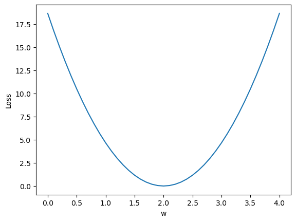
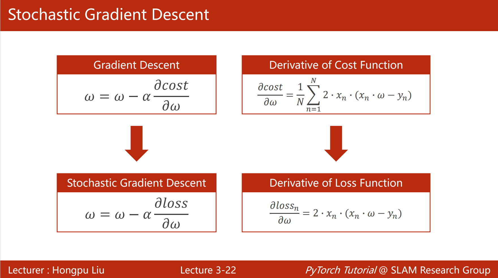

# Pytorch 深度学习实践


## 参考

- [《PyTorch深度学习实践》完结合集_哔哩哔哩_bilibili](https://www.bilibili.com/video/BV1Y7411d7Ys/?vd_source=20a06b23177df8693b090d0b034b2d94)
- [《动手学深度学习》 — 动手学深度学习 2.0.0 documentation (d2l.ai)](https://zh.d2l.ai/index.html)


## 1 环境配置

- Pytorch Stable (2.0.1) 官网安装：https://pytorch.org/get-started/locally/


> 创建环境

```sh
conda create -n pydl01 python=3.9 -y
```

> 激活虚拟环境

```sh
conda activate pydl01
```

> 安装 Pytorch

```sh
conda install pytorch torchvision torchaudio pytorch-cuda=11.7 -c pytorch -c nvidia -y
```

> 安装编译环境

```sh
conda install jupyterlab matplotlib -y
```


## 2 线性模型

1、Data Set 准备数据集，分成

- 训练集：可能会出现过拟合情况
- 验证集：测验模型泛化能力
- 测试集：模拟真实模型的应用场景

2、Model 根据数据集情况选择或设计模型

3、Training 训练模型

4、Inferring 推广模型应用

### 2.1 模型设计

$$
\hat{y}=x*\omega
$$

- $\omega$ ：随机猜测的权重值

### 2.2 损失函数

一个样本的损失：损失函数 Training Loss (Error)

$$
loss=(\hat{y}-{y_i})^2=(x*\omega-{y_i})^2
$$

所有样本的平均损失：平均平方误差 Mean Square Error (MSE)

$$
MSE=cost(\omega)=\frac{1}{N}\sum_{i=1}^{N}{(\hat{y}_i-{y_i})^2}
$$

- N：样本总数

### 2.3 损失曲线

绘制出各个权重对应的损失函数曲线，最低值对应的就是最优权重。



在深度学习训练中，训练误差会随着 **训练轮数** 的增加一直减少，直到某个区间时，误差又增大了，这是因为 **过拟合** 的情况，所以需要通过图像来判断最优区间。绘制模型可视化包：

- Visdom
- Tensorboard

### 2.4 代码实操

课堂代码：

课后习题：

参考：

- https://blog.csdn.net/gtf215998315/article/details/122498842
- https://blog.csdn.net/qq_44948213/article/details/126360152


## 3 梯度下降算法

### 3.1 分治法

划分空间，进行搜索，容易受 到局部最优解干扰。

### 3.2 梯度

梯度 `Gradient` 表示在某一点处的上升或下降的速度。
$$
\begin{align}

\frac{\partial cost(\omega)}{\partial \ \omega}

&=\frac{\partial}{\partial \ \omega}\frac{1}{N}\sum_{i=1}^N{({x_i}\cdot\omega-{y_i})^2}\\

&=\frac{1}{N}\sum_{i=1}^N\frac{\partial}{\partial \ \omega}({x_i}\cdot\omega-{y_i})^2\\

&=\frac{1}{N}\sum_{i=1}^N 2\cdot({x_i}\cdot\omega-{y_i})\frac{\partial \ ({x_i}\cdot\omega-{y_i})}{\partial \ \omega}\\

&=\frac{1}{N}\sum_{i=1}^N 2\cdot{x_i}\cdot({x_i}\cdot\omega-{y_i})

\end{align}
$$

- 鞍点：$g=0$

### 3.3 梯度下降

向导数的负方向更新权重，但是仍然很难找到 **全局最优解**
$$
\omega=\omega-\alpha \frac{\partial cost}{\partial \omega}

=\omega-\alpha\frac{1}{N}\sum_{i=1}^N 2\cdot{x_i}\cdot({x_i}\cdot\omega-{y_i})
$$

- $\alpha$：学习率，向前的步长，尽可能地小

### 3.4 随机梯度下降

Stochastic Gradient Descent (SGD) 随机梯度下降，应用广泛。

**每一个样本**的随机性噪声会驱使结果跨越过鞍点，尽可能地找到全局最优解。



- 梯度下降：效率较高，但精度不够
- 随机梯度下降：精度较高，但无法并行，时间复杂度高，计算时间较长，效率较低
- batch_size：折中精度和时间复杂度的小批量训练（mini_batch）

### 3.5 代码实操

梯度下降：

随机梯度下降：
