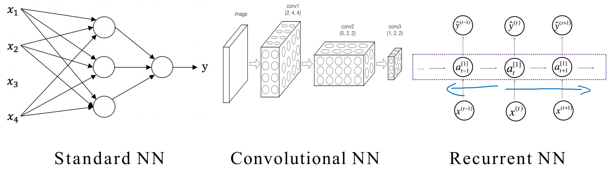

# Neural Networks and Deep Learning

官网视频课程：https://www.coursera.org/learn/neural-networks-deep-learning/lecture/


## 1 基本概念

### 1.1 神经网络

**1、深度学习：**一般指的是训练神经网络，有时是非常非常大（深）的神经网络。

**2、Sigmoid 函数：**

$$
\sigma(z)=\frac{1}{1+e^{-z}}, \ \ z\in R
$$

- 从 0 平滑地升高到 1，但是在两端梯度为 0，不利于后续计算


<center>图 1.1.1 Sigmoid 函数图</center>

**3、ReLU (Rectified Linerar Unit) 函数：**修正线性单元函数，可以在单一神经元内所运行的函数。

深度学习的一大重点突破就是将激活函数从 sigmoid 函数迁移到 ReLU 函数，这样可以很好地提高梯度下降算法的速度。

**4、神经元：**在其内部可以运行一个函数，比如 ReLU 函数，其他非线性函数


<center>图 1.1.2 房价预测示例图</center>

**5、神经网络：**由许多单一神经元叠加组成


<center>图 1.1.3 房价预测中的简易神经网络示例</center>

- 给定足够多的训练示例 x 和 y，神经网络就能够很好地拟合出一个函数来建立 x 与 y 之间的映射关系。


<center>图 1.1.4 房价预测中的简易神经网络抽象化</center>

### 1.2 监督学习与神经网络

**1、监督学习：**把一个输入的 x 与一个输出的 y 相对应起来，神经网络与监督学习密不可分。

**2、几种神经网络**

- StandNN：标准神经网络，用于广告推荐，房价预测……
- CNN：卷积神经网络，常用于图像数据，如图像分类……
- RNN：循环神经网络，常用于序列化数据，应用于语言翻译和录音识别……



<center>图 1.2.1 三种神经网络示例图</center>

**3、结构化数据**

对于每一个特征都有清晰的定义，常用的有数据库表。

**4、非结构化数据**

非结构化数据主要是音频、图像、文本等数据，对于这些数据计算机很难理解，但是人类却能够很好地理解。深度学习通过神经网络能够更好地解释非结构化数据，例如语音识别、图像识别、NLP……

- 图像像素值
- 文本中的独立单词


<center>图 1.2.2 非结构化数据示例图</center>

**5、神经网络与其他算法的比较**

- 在较小的训练数据集中，神经网络的优势可能并不明显；当训练数据集很大时，神经网络的优势将会凸显
- 大、中、小型神经网络
- 传统机器学习算法：SVM 支持向量机、Logistic Regression 逻辑回归、……


<center>图 1.2.3 不同算法在不同数据规模的表现</center>

1、Data：庞大的数据规模

2、Computation：高效的设备算力，提高计算速度

3、Algorithms：算法优化创新


## 2 基于神经网络的逻辑回归

### 2.1 Binary Classification 二元分类

**1、二元分类**

- 对于输入的数据，经过计算，输出一个 0，1 标签的结果
- 例如将图片中的 RGB 色彩矩阵作为输入数据，经过计算，辨别图像是否有猫，有为 1，无则为 0。

**2、单个样本 $(x, y)$**

- x：一个 $n(x)$ 维的特征向量
- y：label 标签，$y\in\{0, 1\}$

**3、训练集**

- $\{(x^{(1)}, y^{(1)}), (x^{(2)}, y^{(2)}), \cdots, (x^{(m)}, y^{(m)})\}$
- $m=M_{train}$：训练集的样本总数
- $(x^{(1)}, y^{(1)})$：第一个样本的输入与输出

**4、训练集的输入矩阵 $X$**

$$
X=
\begin{bmatrix}
  |&  |&  |&  |\\
  |&  |&  |&  |\\
  x^{(1)}&  x^{(2)}&  \cdots&  x^{(m)}\\
  |&  |&  |&  |\\
  |&  |&  |&  |
\end{bmatrix}
$$

- 将训练样本的输入 **<u>按列排列</u>** 的形式（按列会简单一些）
- `X.shape = (nx, m)`：X 是一个 $n_x$ 行，$m$ 列的矩阵

**5、训练集的输出矩阵 $Y$**

$$
Y=[y^{(1)}, y^{(2)}, \cdots, y^{(m)}]
$$

- `Y.shape = (1, m)`：Y 是一个 1 行，$m$ 列的矩阵

### 2.2 Logistic Regression 逻辑回归模型

#### 2.2.1 逻辑回归模型

给定一个训练数据集 $\{(x^{(1)}, y^{(1)}), \cdots, (x^{(m)}, y^{(m)})\}$，想要得到 $y^{(i)}\approx \hat{y}^{(i)}$ 的结果。

$$
\begin{align}
\hat{y}^{(i)}&=P(y=1|\ x^{(i)}) \\\\
&=\sigma(z^{(i)})=\frac{1}{1+e^{-z^{(i)}}} \\\\
&=\sigma(w^T x^{(i)}+b)
\end{align}
$$

- $\hat{y}$：预测图片是猫的图片的概率

- 相关参数：$w$ 是一个维度为 $n^{(x)}$ 的向量，$b$ 是一个实数

#### 2.2.2 Loss 损失函数

损失函数计算单个训练样例的误差，是针对单个训练样例定义的函数，用于衡量在单个训练样本上的表现。

- （半）平方误差：$loss(\hat{y},y)=\frac{1}{2}(\hat{y}-y)^2$

- 应用于逻辑回归的损失函数：

  $loss(\hat{y},y)=-[y^{(i)} \ln^{\hat{y}^{(i)}}+(1-y^{(i)}) \ln^{(1-\hat{y}^{(i)})}]$


#### 2.2.3 Cost 成本函数

代价函数是整个训练集损失函数的平均值，是针对整个训练样例定义的函数，用于衡量在整个训练集上的表现。是一个凸函数 (convex function)，能够找到最低点，得到局部最优解 (local optima)。

$$
\begin{align}
J(w,b)&=\frac{1}{m}\sum_{i=1}^{m}loss(\hat{y}^{(i)}, y^{(i)}) \\\\
&=-\frac{1}{m}\sum_{i=1}^{m}[y^{(i)} \ln^{\hat{y}^{(i)}}+(1-y^{(i)}) \ln^{(1-\hat{y}^{(i)})}]
\end{align}
$$

### 2.3 Gradient Descent 梯度下降算法

**1、梯度下降：**找到 $w, \ b$ 使得成本函数 $J(w,b)$ 的结果尽可能地小，以此来减小误差。

**2、渐变梯度下降算法：**通过不断迭代，将初始点向最陡的下坡方向（下降最快的方向）前进，直到到达最低点。


<center>图 2.1 梯度下降示意图</center>

**3、斜率与最优解**

- derivative 导数，slope 斜率，partial derivative 偏导数
- 对于成本函数 $J(w,b)$ 迭代求出最优解
- 这里的偏导符号 $\partial$，在实际编程中作为积分符号 $d$ 处理，$\alpha$ 是学习率

$$
w:=w-\alpha \frac{\partial J(w,b)}{\partial w}=w-\alpha dw \\\\
b:=b-\alpha \frac{\partial J(w,b)}{\partial b}=b-\alpha db
$$

### 2.4 Computation Graph 计算流程图

神经网络中的计算即是由多个计算网络输出的前向传播与计算梯度的后向传播构成。对于函数 $J(a,b,b)=3(a+bc)$

**1、前向传播（Forward Propagation）：**按顺序计算代价函数。


<center>图 2.2 前向传播计算流程图</center>

**2、反向传播（Backward Propagation）：**当需要计算最终值相对于某个特征变量的导数时，需要利用计算图中上一步的结点定义。（遵循积分中的链式法则）

$$
\frac{dJ}{db}=\frac{dJ}{dv}\cdot\frac{dv}{du}\cdot\frac{du}{db}
$$


<center>图 2.3 反向传播计算流程图（红）</center>

**3、代码规定**

- 在 Python 代码中，为了减少变量名，约定了 $dvar$ 作为积分的结果，它代表着最终输出变量相对于各种中间量的导数。

$$
dvar=\frac{dFinalOutputVar}{dvar}
$$

### 2.5 逻辑回归的梯度下降

#### 2.5.1 单个样本的损失函数

对于逻辑回归，相关公式如下：

$$
\begin{flalign}
&z = w^T x + b \\\\
&\hat{y} = a = \sigma(z) = \frac{1}{1 + e^{-z}} \\\\
&L(a, y) = -(y \ln^{(a)} + (1 - y) \ln^{(1 - a)})
\end{flalign}
$$

- 对于单一样本前向传播计算损失函数。


<center>图 2.4 逻辑回归前向传播</center>

- 若计算损失函数关于 z 的导数，需要通过后向传播（链式法则）计算导数

$$
\begin{align}
\frac{dL(a,y)}{dz}
=\frac{dL(a,y)}{da}\cdot\frac{da}{dz} 
=\frac{a-y}{a(1-a)}\cdot a(1-a)
=a-y
\end{align}
$$

#### 2.5.2 整体样本的成本函数

$$
\begin{align}
J(w,b)&=\frac{1}{m}\sum_{i=1}^{m}L(a^{(i)}, y^{(i)}) \\\\
dw_1=\frac{\partial {J(w,b)}}{\partial w_1}&=\frac{1}{m}\sum_{i=1}^{m}\frac{\partial}{\partial w_1}L(a^{(i)}, y^{(i)}) \\\\
&=\frac{1}{m}\sum_{i=1}^{m}dw_{1}^{(i)}
\end{align}
$$

### 2.6 Vectorization 向量化

#### 2.6.1 基础理论

**1、向量化：**在深度学习中，一定要避免使用 for loop，而是改用向量化计算，这样可以加快计算的速度。


<center>图 2.5 向量计算与 For 循环计算时间对比</center>

**2、SIMD 指令：**Single Instruction Multiple Data，代表了一种使用 **单条指令** 对 **多个数据** 进行 **并行操作** 的技术。如果使用了 (build-in) 内置函数，像这样 `np.function` 或者不需要实现循环的函数，这使得 python 中的 numpy 能够充分利用 SIMD 指令去更快地计算，GPU 被认为更加擅长 SIMD 计算。

**3、build-in 内置函数**：

在使用 for 循环前，先查看是否可以用内置函数避免使用 for 循环。

- `np.exp(v)`：对向量中每个元素求 e
- `np.log(v)`：对向量中每个元素求对数
- `np.abs(v)`：对向量中每个元素求绝对值

#### 2.6.2 向量化计算逻辑回归预测值

1、将输入数据的 $x^{(1)}, x^{(2)}, \cdots, x^{(m)}$ 组合成矩阵 $X$

$$
X=
\begin{bmatrix}
  |&  |&  |&  |\\
  |&  |&  |&  |\\
  x^{(1)}&  x^{(2)}&  \cdots&  x^{(m)}\\
  |&  |&  |&  |\\
  |&  |&  |&  |
\end{bmatrix}
$$

2、参数 $w$ 是一个 m 维的列向量，将参数  $b$ 扩展成 m 维的行向量（在实际操作中，当出现向量+常量的情况时，Python 会自动将常量扩展成向量）

3、将公式 $z=w^Tx+b$，变成如下形式：

$$
\begin{align}
Z&=[z^{(1)}, z^{(2)}, \cdots, z^{(m)}]=w^TX+[b,b,\cdots,b] \\\\
&=[w^Tx^{(1)}+b, w^Tx^{(2)}+b,\cdots,w^Tx^{(m)}+b]
\end{align}
$$

- 在 Numpy 中对应代码 `Z = np.dot(wT, x) + b`

4、将预测值也使用向量表示

$$
A=[\hat{y}^{(1)},\hat{y}^{(2)},\cdots,\hat{y}^{(m)}]=[a^{(1)}, a^{(2)}, \cdots, a^{(m)}]=\sigma(Z)
$$

#### 2.6.3 向量化同时计算逻辑回归的梯度

1、将单个样本的梯度值 $dz^{(1)}=a^{(1)}-y^{(1)}$ 组合成向量 $dZ$

$$
\begin{align}
dZ&=[dz^{(1)},dz^{(2)},\cdots,dz^{(m)}] \\\\
&=A-Y
=[a^{(1)}-y^{(1)},a^{(2)}-y^{(2)},\cdots,a^{(m)}-y^{(m)}]
\end{align}
$$

2、关于 $b$ 的求导 $db$，可以表示为：

$$
db=\frac{1}{m}\sum_{i=1}^{m}dz^{(i)}
=\frac{1}{m}np.sum(dZ)
$$

3、关于 $w$ 的求导 $dw$，可以表示为：

$$
dw=\frac{1}{m}X{dZ}^T
$$

4、更新梯度下降参数

$$
w:=w-\alpha dw \\
b:=b-\alpha db
$$

5、为了使梯度迭代指定的次数，需要在上述步骤中整合到 for 循环中。

### 2.7 Broadcasting 广播

#### 2.7.1 Broadcasting 代码示例

**1、创建矩阵**

- 创建一个 3 × 4 的矩阵

```python
A = np.array([[56.0,0.0,4.4,68.0],
              [1.2,104.0,52.0,8.0],
              [1.8,135.0,99.0,0.9]])
```

**2、按列求和**

- 对每一列进行求和，`axis=0` 表示垂直方向求和，得到一个 1×4 的矩阵

```python
cal = A.sum(axis=0)
```

**3、计算百分比**

- reshape 操作：在不确定矩阵维数时，reshape 的调用成本很低，可以使用 `np.reshape(m,n)`  来指定行列数。

```python
percentage = 100*A/cal.reshape(1,4)
```

**4、打印输出**

```python
print("矩阵A: \n", A)
print("每一列总和: \n", cal)
print("每项占比: \n", percentage)
```


<center>图 2.6 Broadcasting 示例输出</center>

#### 2.7.2 Broadcasting 常用原则

- 向量 + 常量时，Python 会自动将常量扩展为向量

$$
\begin{bmatrix}
 1\\
 2\\
 3
\end{bmatrix}
+100=
\begin{bmatrix}
 1\\
 2\\
 3
\end{bmatrix}
+
\begin{bmatrix}
 100\\
 100\\
 100
\end{bmatrix}
=
\begin{bmatrix}
 101\\
 102\\
 103
\end{bmatrix}
$$

- $m\times n$ 的矩阵加减乘除上 $1\times n$ 的矩阵，Python 会自动将后者复制 $m-1$ 次，使其也变为一个 $m\times n$ 的矩阵

$$
\begin{bmatrix}
  1& 2\\
  3& 4
\end{bmatrix}
+
\begin{bmatrix}
  100& 200
\end{bmatrix}
=
\begin{bmatrix}
  1& 2\\
  3& 4
\end{bmatrix}
+
\begin{bmatrix}
  100& 200\\
  100& 200
\end{bmatrix}
=
\begin{bmatrix}
  101& 202\\
  103& 204
\end{bmatrix}
$$

- 同理，$m\times n$ 的矩阵加减乘除上 $m\times 1$ 的矩阵，Python 会自动将后者复制 $n-1$ 次，使其也变为一个 $m\times n$ 的矩阵

$$
\begin{bmatrix}
  1& 2\\
  3& 4
\end{bmatrix}
+
\begin{bmatrix}
  100\\
  200
\end{bmatrix}
=
\begin{bmatrix}
  1& 2\\
  3& 4
\end{bmatrix}
+
\begin{bmatrix}
  100& 100\\
  200& 200
\end{bmatrix}
=
\begin{bmatrix}
  101& 102\\
  203& 204
\end{bmatrix}
$$

### 2.8 Python 向量编码技巧

**1、不要使用秩为 1 的数组**

- 在处理秩为 1 的矩阵时，可以先将使用 `reshape` 其转化为一个列向量
- 在生成随机数组时，可以先指定数组的形状，不要使用秩为 1 的数组

**2、使用 assert 复查矩阵和数组的维度**

- 强制让矩阵变为一个 5×1 的列向量
- `assert()` 的运行成本与 `reshape` 一样都很低，不需要考虑成本问题。

```python
assert(a.shape==(5,1))
```


## 3 浅层神经网络

### 3.1 单隐藏层神经网络结构

#### 3.1.1 网络结构图解

下面是一个简单的神经网络结构图，它是双层神经网络，包括一个隐藏层和一个输出层。（一般计算分层时不包括输入层）


<center>图 3.1 含有一个隐藏层的神经网络</center>

**1、输入层**：将输入数据以矩阵/向量的形式表示

$$
a^{[0]}=x^{(1)}=\begin{bmatrix}
x^{(1)}_1\\
x^{(1)}_2\\
x^{(1)}_3
\end{bmatrix},\
x^{(1)}\in \mathbb{R}^{3\times 1}
$$

**2、隐藏层**：把向量 $x^{(1)}$ 作为输入计算激活函数，一个节点生成一个值

- 隐藏层是指在训练集中间这一层节点的真实值，无法被直接观察
- 有两个相关参数：权重 $w^{[1]}\in \mathbb{R}^{4\times 3}$，其中行数：4（4 个结点），列数：3（3 个输入值），以及偏差 $b^{[1]}\in \mathbb{R}^{4\times 1}$

$$
a^{[1]}=\begin{bmatrix}
a^{[1]}_1
\\
a^{[1]}_2
\\
a^{[1]}_3
\\
a^{[1]}_4
\end{bmatrix}=\sigma{(z^{[1]})}=
\begin{bmatrix}
\sigma(z^{[1]}_1)
\\
\sigma(z^{[1]}_2)
\\
\sigma(z^{[1]}_3)
\\
\sigma(z^{[1]}_4)
\end{bmatrix}=
\begin{bmatrix}
\sigma({w^{[1]}_1}^T x^{(1)}+b^{[1]}_1)
\\
\sigma({w^{[1]}_2}^T x^{(1)}+b^{[1]}_2)
\\
\sigma({w^{[1]}_3}^T x^{(1)}+b^{[1]}_3)
\\
\sigma({w^{[1]}_4}^T x^{(1)}+b^{[1]}_4)
\end{bmatrix},\
a^{[1]}\in \mathbb{R}^{4 \times 1}
$$

**3、输出层**：再次使用激活函数生成一个实数值，并传递给 $\hat{y}$

- 也有两个相关参数：权重 $w^{[2]}\in \mathbb{R}^{1\times 4}$ 和偏差 $b^{[2]}\in \mathbb{R}^{1\times 1}$

$$
a^{[2]}=\sigma({z^{[2]}})=\sigma({w^{[2]}}a^{[1]}+b^{[2]})=\hat{y},\ a^{[2]}\in \mathbb{R}
$$

#### 3.1.2 网络输出原理

**1、逻辑回归神经网络**

- 逻辑回归神经网络实际上就是，在每个节点上，先计算逻辑回归，然后将结果进行计算 sigmoid，计算多次后的结果即为神经网络的输出结果。

**2 向量化实现神经网络**

- 在实现神经网络时，最好使用向量化计算，而在进行向量化时，当 一层中有不同的神经元（多个节点）时，可以把他们堆叠起来，组成一个向量。
- 通过把训练样本堆叠在矩阵的不同列中，使得神经网络不仅能计算单个样本上的输出值，也能计算整个训练样本集上的输出值。 

### 3.2 向量化样本

#### 3.2.1 单样本向量化

1、通过向量化运算，得出隐藏层 $a^{[1]}$ 里四个逻辑回归的输出

$$
\begin{align}
z^{[1]}&=W^{[1]}x+b^{[1]}=W^{[1]}a^{[0]}+b^{[1]}\\\\
a^{[1]}&=\sigma(z^{[1]})
\end{align}
$$

2、用 $a^{[1]}$ 的四个输出作为 $a^{[2]}$ 层的输入

$$
\begin{align}
z^{[2]}&=W^{[1]}a^{[0]}+b^{[1]}\\\\
a^{[2]}&=\sigma(z^{[2]})=\hat{y}
\end{align}
$$

#### 3.2.2 多样本向量化

基于多个训练样本向量化神经网络方法，应该避免使用 for 循环，将样本们及其相关参数的向量水平方向堆叠成一个矩阵，对于每个矩阵的元素：

- 从左到右表示每一个样本，$m$ 个样本
- 从上到下表示每个样本中的不同节点，$n_x$ 个节点

#### 3.2.3 前向传播向量化步骤

**1、输入层**

$$
X=\begin{bmatrix}
  |&  |&  |&  |\\
  x^{(1)}&  x^{(2)}&  \cdots&  x^{(m)}\\
  |&  |&  |&  |
\end{bmatrix},\ X\in \mathbb{R}^{(n_x, m)}
$$

**2、第一层（隐藏层）**

$$
Z^{[1]}=W^{[1]}X+b^{[1]}=\begin{bmatrix}
  |&  |&  |&  |\\
  Z^{[1](1)}&  Z^{[1](2)}&  \cdots&  Z^{[1](m)}\\
  |&  |&  |&  |
\end{bmatrix},\ Z^{[1]}\in \mathbb{R}^{(n_x, m)}\\\\
A^{[1]}=\sigma(Z^{[1]})=\begin{bmatrix}
  |&  |&  |&  |\\
  a^{[1](1)}&  a^{[1](2)}&  \cdots&  a^{[1](m)}\\
  |&  |&  |&  |
\end{bmatrix},\ A^{[1]}\in \mathbb{R}^{(n_x, m)}
$$

**3、第二层（输出层）**

$$
Z^{[2]}=W^{[2]}A^{[1]}+b^{[2]}=\begin{bmatrix}
  |&  |&  |&  |\\
  Z^{[2](1)}&  Z^{[2](2)}&  \cdots&  Z^{[2](m)}\\
  |&  |&  |&  |
\end{bmatrix},\ Z^{[2]}\in \mathbb{R}^{(n_x, m)}\\\\
A^{[2]}=\sigma(Z^{[2]})=\begin{bmatrix}
  |&  |&  |&  |\\
  a^{[2](1)}&  a^{[2](2)}&  \cdots&  a^{[2](m)}\\
  |&  |&  |&  |
\end{bmatrix},\ A^{[2]}\in \mathbb{R}^{(n_x, m)}
$$

#### 3.2.4 向量化证明

一个神经网络中的不同层，大致上都在做着相同的事情，或者说一遍又一遍地做着相同的计算。


<center>图 3.2 多样本向量化示例图</center>

### 3.3 激活函数

#### 3.3.1 为什么使用非线性激活函数？

**1、线性激活函数**

- 恒等激活函数，使用后结果只是输入数据的线性变换，只有在研究 **回归问题** 时才具有实际意义
- 在输出层可以使用线性激活函数，其他层几乎不会使用

**2、非线性激活函数**

很多实际问题都是非线性的，为了加入非线性因素，提高神经网络对实际问题的表达能力，需要对数据进行处理，让计算机根据自定义标准对数据进行判断，常用的有：

- sigmoid 函数、$\tanh(z)$ 函数、ReLU 函数等

#### 3.3.2 sigmoid 函数及其导数

**1、sigmoid 函数**

在前文中使用的激活函数都是 $\sigma(z)$ 函数，进行二元分类时，输出层使用 $\sigma(z)$ 函数的效果会比较好。其他的分类最好不要使用。

$$
a=g(z)=\sigma(z)=\frac{1}{1+e^{-z}},\ a\in [0,1]
$$

**2、sigma 函数在 z 点上的导数（斜率）**

$$
\begin{align}
g'(z)=\frac{d}{dz}g(z)&=\frac{1}{1+e^{-z}}(1-\frac{1}{1+e^{-z}})\\\\
&=g(z)[1-g(z)]\\\\
&=a(1-a)
\end{align}
$$


<center>图 3.3 sigma 函数图像</center>

#### 3.3.3 $\tanh(z)$ 函数及其导数

**1、$\tanh(z)$ 函数**

$\tanh(z)$ 函数是 $\sigma()$ 函数平移后的版本。它的平均值更接近 0，使得计算出数据具有更好的 **中心性**，计算效果会更好。

$$
a=g(z)=\tanh(z)=\frac{e^z-e^{-z}}{e^z+e^{-z}},\ a\in [-1,1]
$$

**2、$\tanh(z)$ 函数在 z 点上的导数（斜率）**

$$
\begin{align}
g'(z)=\frac{d}{dz}g(z)&=1-[\tanh(z)]^2\\\\
&=1-g(z)^2\\\\
&=1-a^2
\end{align}
$$


<center>图 3.4 tanh 函数图像</center>

#### 3.3.4 ReLU 函数及其导数

**1、ReLU 函数**

ReLU 函数，作为激活函数适用性相当广泛，是激活函数的 **默认选择**，相比其他激活函数计算速度更快。

$$
a=max(0,\ z)
$$

**2、ReLU 函数在 z 点上的导数（斜率）**

- $z>0$，斜率为正（导数为 1）
- 对于 $z=0$ 时，导数的值无关紧要，可以是 0，也可以是 1
- $z<0$，斜率为负

$$
\begin{align}
g'(z)=\frac{d}{dz}g(z)&=
\left\{\begin{matrix}
0 & ,if\ z<0 \\
1 & ,if\ z>0 \\
undefine & ,if\ z=0
\end{matrix}\right.
\end{align}
$$


<center>图 3.5 ReLU 函数图像</center>

#### 3.3.5 Leaky ReLU 函数及其导数

**1、Leaky ReLU**

由于 ReLU 函数在小于 0 时，导数为 0，所以在小于 0 时，对 ReLU 函数进行优化。

$$
a=max(0.01z,\ z)
$$

**2、Leaky ReLU 函数在 z 点上的导数（斜率）**

$$
\begin{align}
g'(z)=\frac{d}{dz}g(z)&=
\left\{\begin{matrix}
0.01 & ,if\ z<0 \\
1 & ,if\ z>0 \\
undefine & ,if\ z=0
\end{matrix}\right.
\end{align}
$$


<center>图 3.6 Leaky ReLU 函数图像</center>

#### 3.3.6 激活函数的选择

**1、一般情况下：**所有层全部使用 ReLU 函数

**2、二元分类时：**在隐藏层使用 ReLU 函数，而在输出层使用 $\sigma(z)$ 函数（不同层的激活函数可以不同）

**3、不确定时：**在交叉验证数据集中对不同激活函数进行测试，看哪一个的参数效果更好，就使用哪一个

### 3.4 后向传播 - 梯度下降

正向传播：求出预测值

反向传播：求出梯度（斜率）

#### 3.4.1 单个样本的梯度计算

$$
\begin{align}
&dz^{[2]}=a^{[2]}-y\\\\
&dW^{[2]}=dz^{[2]}{a^{[1]}}^T\\\\
&db^{[2]}=dz^{[2]}\\\\
&dz^{[1]}={W^{[2]}}^Tdz^{[2]}*g'^{[1]}(z^{[1]})\\\\
&dW^{[1]}=dz^{[1]}x^T\\\\
&db^{[1]}=dz^{[1]}
\end{align}
$$

#### 3.4.2 多样本梯度计算

$$
\begin{align}
&dZ^{[2]}=A^{[2]}-Y\\\\
&dW^{[2]}=\frac{1}{m}dZ^{[2]}{A^{[1]}}^T\\\\
&db^{[2]}=\frac{1}{m}np.sum(dz^{[2]},\ axis=1,\ keepdims=True)\\\\
&dZ^{[1]}={W^{[2]}}^TdZ^{[2]}*g'^{[1]}(Z^{[1]})\\\\
&dW^{[1]}=\frac{1}{m}dZ^{[1]}X^T\\\\
&db^{[1]}=\frac{1}{m}np.sum(dz^{[1]},\ axis=1,\ keepdims=True)
\end{align}
$$

#### 3.4.3 学习率控制梯度下降

$$
\begin{align}
W&=W-\alpha dW^{[1]}\\\\
b&=b-\alpha db^{[1]}
\end{align}
$$

### 3.5 随机初始化权重

在逻辑回归的问题中，把权重参数初始化为零是可行的。但把神经网络的权重参数全部初始化为零，并使用梯度下降，将无法获得预期的效果，所以需要对权重进行随机初始化。

$$
\begin{align}
W^{[1]}&=np.random.randn((m,n))*0.01\\\\
b^{[1]}&=np.zero((m,n))
\end{align}
$$

**1、随机初始化权重**：将权重 W 初始化为 $(m,n)$ 的高斯分布随机变量

- 随机值最好非常非常小，因为小的权重更有利于计算激活函数。
- 如果权重过大，会导致激活函数（如 sigmoid 函数和 $\tanh$ 函数）过于饱和，梯度接近于 0，不利于进行梯度下降，会减慢学习速度.
- 对于较为深层的神经网络，应该设置更为小的参数

**2、将偏差初始化为 0**：偏差 $b$ 仍然可以是 0


## 4 深层神经网络

### 4.1 基本概念

无法预先准确地判断需要多深的神经网络，可以先尝试着使用 logistic 回归（单层神经网路），然后再逐步增加一到两个隐藏层，把隐藏层数量当作一个可以自由调整数值大小的超参数去调试，找到比较适合的深度。

### 4.2 确保维度正确

在实现深度神经网络时，清晰地知道每个矩阵和向量的维度，能够很好地排除编程中的 bug。


<center>图 4.1 深层神经网络结构图</center>

1、对于网络的第一层隐藏层：
$$
\begin{align}
z^{[1]}&=w^{[1]}\cdot x+b^{[1]}\\\\\
a^{[1]}&=g^{[1]}(z^{[1]})
\end{align}
$$

- $ w^{[1]}\in \mathbb{R}^{3\times 2}$，维度为 $(n^{[1]},\ n^{[0]})$
- $x\in \mathbb{R}^{2\times 1}$，维度为 $(n^{[0]},\ 1)$
- $b^{[1]},\ z^{[1]},\ a^{[1]} \in \mathbb{R}^{3\times 1}$，维度都是 $(n^{[1]},\ 1)$

2、对于有 L 层的神经网络，

- 权重参数 $w^{[L]}$ 的维度必为 $(n^{[L]},\ n^{[L-1]})$
- 偏差参数 $b^{[L]}$ 的维度必为 $(n^{[L]},\ 1)$

- $dw^{[L]}$ 的维度必为 $(n^{[L]},\ n^{[L-1]})$
- $db^{[L]}$ 的维度必为 $(n^{[L]},\ 1)$

### 4.3 构建神经网络结构

#### 4.3.1 正向传播

对于第 L 层的某个节点

**1、输入：** $a^{[L-1]}$

**2、输出：**

- $a^{[L]}$，作为下一层的输入
- 缓存 $Z^{[L]},\ W^{[L]},\ b^{[L]}$ 的值，用于反向传播时计算梯度

#### 4.3.2 反向传播

**1、输入：**$da^{[L]}$

**2、输出：**$da^{[L-1]},\ dW^{[L]},\ db^{[L]}$

- 通过缓存的数值，进行梯度计算

3、梯度下降：利用计算出的导数不断减小权重和偏差值


<center>图 4.2 梯度下降流程图</center>

### 4.4 超参数调优

超参数是指能够控制参数的参数。比如：

- 学习率：$\alpha$
- 每个隐藏层的单元数
- 神经网络总层数
- 隐藏层的迭代次数


