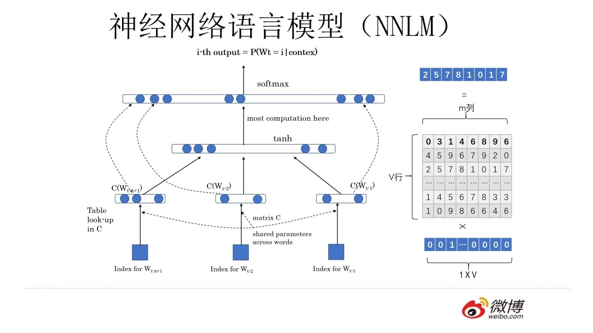

# 预训练语言模型基础理论


## 学习参考

- 理论部分：[Transformer、GPT、BERT，预训练语言模型的前世今生（目录） - 水论文的程序猿 - 博客园 (cnblogs.com)](https://www.cnblogs.com/nickchen121/p/15105048.html)
- 代码部分：[graykode/nlp-tutorial: Natural Language Processing Tutorial for Deep Learning Researchers (github.com)](https://github.com/graykode/nlp-tutorial)


## 1 预训练


### 1.1 预训练概念

- 不同业务的逻辑也许是相似的
- 通过已经训练好的模型 A，使用 A 的浅层参数
- 用小型专项的数据量去训练完成任务 B
- 最终得到一个模型 B（节省训练时间、节省成本）

可以通过微调和冻结进行处理。


## 2 语言模型

**语言模型：**语言+模型，解决两大任务

- 对于任意的词序列，它能够计算出这个序列是一句话的概率
- 计算下一个词可能是什么。

### 2.1 统计语言模型

#### 2.1.1 基本概念

**统计语言模型：**统计+语言模型，用统计的方法去解决两大类问题。

**比较合适词（选择）：**P(“判断这个词的词性”)，P(“判断这个词的磁性”)

“判断这个词的词性” = “判断”，“这个”，“词”，“的”，“词性”

“判断这个词的磁性” = “判断”，“这个”，“词”，“的”，“磁性”

1、先把整个句子进行序列化（有顺序的）分词处理

2、条件概率的链式法则
$$
P(w_1,w_2,···,w_n)=P(w_1)P(w_2|w_1)P(w_3|w_1,w_2)···P(w_n|w_1,w_2,···,w_{n-1})\\
=\prod_{i} P(w_i|w_1,w_2,···,w_{i-1})
$$

3、使用发则对求出每个词的概率，然后连乘，就是这句话出现的概率

**预测下一个词（填空）：**“判断这个词的 `______`”

1、条件概率公式
$$
P(w_{next}|判断,这个,词,的)=\frac{count(w_{next},判断,这个,词,的)}{count(判断,这个,词,的)}
$$
2、把给定词库（词典）中的所有词做成一个集合 V
$$
w_{next} \in V
$$
3、把集合中每一个词都进行概率计算，选取概率最大的结果

#### 2.1.2 n 元统计语言模型

从 n 个词中，只取出 2 个词（二元），3 个词（三元）

例如：对于下列语句：

```
“词性是动词”
“判断单词的词性”
“磁性很强的磁铁”
“北京的词性是名词”
```

$$
𝑃(词性|的) = \frac{count(词性,的)}{count(的)}
 = \frac{2}{3}
$$

**平滑策略**：为了防止 $P(飞机|火车) = \frac{0}{0}$ 的情况出现，即两个词都不在集合中的情况。
$$
P(w_i|w_{i-1})=\frac{count(w_i,w_{i-1})+1}{count(w_{i-1})+|V|}
$$

### 2.2 神经网络语言模型 NNML

**神经网络语言模型：**神经网络+语言模型，用神经网络的方法去解决两大类问题。主要用于**预测词**。

#### 2.2.1 独热编码（one-hot 编码）

**独热编码：**由于字符编码过于庞大，可以只通过重新编码，让计算机认识单词。是一个向量。

例如：对于下图，在词典集合 V 中只有 8 个单词，给出一个 8*8 的矩阵让计算机认识单词。


“time” 	 → 10000000

“fruit”	   → 01000000

…………………………

“banana” → 00000001

**余弦相似度：**通过计算两个向量在空间上距离，从而实际对两者间的关联性，相似度的计算。如 “fruit” 与 “banana”

**独热编码的缺陷：**

- 可能会由于维度过高，导致存储空间过大
- 忽略了词与词之间的关联性

#### 2.2.2 神经网络语言模型预测词



双层感知机

1、得到 4 个单词的独热编码 `w1, w2, w3, w4`

2、Q 是一个随机矩阵，是一个参数（可以不断学习训练得到）

3、进行矩阵计算，得到 `c1, c2, c3, c4` 四个词向量，来代表单词

```
w1*Q=c1,
w2*Q=c2,
w3*Q=c3,
w4*Q=c4,
```

4、进行矩阵拼接

```
C=[c1,c2,c3,c4]
```

5、双层感知机

激活函数 softmax，感知机 $tanh(WQ+b)$
$$
softmax\{U[tanh(WQ+b_1)]+b_2+W_x\}==[0.1, 0.1, 0.2, 0.2, 0.4]\in[1,V_L]
$$

### 2.3 词向量

词向量：由神经网络语言模型的副产品 Q 计算得到，本质就是用一个向量表示一个单词。

- 利用 Q 控制了词向量维度（大小）
- 词向量间进行余弦相似度或矩阵乘法时，可以解决词与词之间的相似度问题


## 3 Word2Vec 模型

第一个专门做词向量的模型，也是一种神经网络语言模型，主要目的是**获取词向量**，副产品才是预测词。主要分为 CBOW 和 Skip-gram 两种训练架构。


### 3.1 CBOW

给出一个词的 ==上下文==，预测得到这个词。

### 3.2 Skip-gram

给出一个词，预测得到词的上下文。

### 3.3 缺点

生成的 Q 矩阵有缺陷，词向量无法表示一词多义的情况。
$$
\begin{bmatrix}
  0&  0&  0&  1&0
\end{bmatrix}
=
\begin{bmatrix}
  17&  24&1 \\
  23&  5&7 \\
  4&  6&13 \\
  10&  12&19 \\
  11&  18&25
\end{bmatrix}
=
\begin{bmatrix}
  10&  12&  19
\end{bmatrix}
$$


## 4 预训练语言模型下游任务改造


预训练语言模型：

1、给出一句话，我们先使用独热编码（一一对应的一种表查询）

2、再使用 Word2Vec 预训练好的 Q 矩阵直接得到词向量

3、然后进行接下来的任务

- 冻结：可以不改变 Q 矩阵

- 微调：随着任务的改变，改变 Q 矩阵


## 5 ELMo 模型

根据词的上下文，把一词多义的情况用不同的词向量来表示，从而实现对一词多义的解决。


## 6 Attention 注意力机制

### 6.1 Attention 基本概念

红色部分就是注意力重点聚焦的部分，可能包含更重要的信息。


注意力机制：模仿人的判断，去计算事物的重要程度。

### 6.2 原理

阶段 1：计算 Query 和 Key 里的每一个事物的重要度（相似度）得到 $S_1,S_2,S_3$

- $K=k_1,k_2,\cdots,k_n$，Q 与 K 一般使用**点乘**运算
- 点乘：求向量间的内积，余弦相似度

阶段 2：做一层 $softmax(S_1,S_2,\cdots,S_n)$，将相似度进行归一化得到对应的概率

- $a_1,a_2,...,a_n$，就是得到的对应概率
- 可以找出哪一个 K 对 Q 而言更为重要

阶段 3：进行一个汇总，计算出 $V'$ 包含每个信息的对应的重要性，注意力值（Attention Value）

- $V=(V_1,V_2,...,V_n)$，一般地，$K=V$，若 $K!=V$，一定具有联系

- $V'=(a_1,a_2,...,a_n)*V=(a_1*V_1+a_2*V_2+\cdots+a_n*V_n)$


<center>图 6-2 注意力机制</center>

### 6.3 Self-Attention 自-注意力机制

关键：$K\approx V\approx Q$，三者同源，都来源于同一个 X

