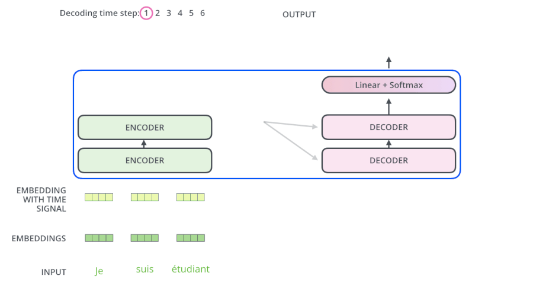

# Transformer 框架理论

## 学习参考

- 理论部分：[Transformer、GPT、BERT，预训练语言模型的前世今生（目录） - 水论文的程序猿 - 博客园 (cnblogs.com)](https://www.cnblogs.com/nickchen121/p/15105048.html)

  

## 1 整体框架

### 1.1 基本介绍

引用了 seq2seq 模型，序列到序列（编码器到解码器）分成了两部分

- 序列：可以是某一句话，或是某一个视频
- 编码器：把输入文本变成一个词向量（Self-Attention）
- 解码器：得到编码器输出的词向量后，生成处理的结果

图 1-1 Transformer 框架结构图

### 1.2 以 Transformer 机器翻译为例

**流程 1：**输入待翻译的文本 → Transformer → 翻译后的文本

图 1-2 

**流程 2：**编码器和解码器

- 编码器 Encoder：把输入序列变成一个词向量（Self-Attetion）
- 解码器 Decoder：得到编码器输出的词向量后，生成翻译的结果

图 1-3 

**流程 3：**Nx

Nx：编码器里面又有 N 个小编码器（默认 N=6），层数越大显存消耗越大

通过 6 个编码器，对词向量一步又一步的强化（增强）

图 1-4 

**流程 4：**FFN (Feed Forward Networks)

双重线性变换：$w_2*(w_1*x_1+b_1)+b_2$

图 1-5 

## 2 编码器 Encoder

### 2.1 基本概念

编码器包括两个子层：

- Self-Attention
- Feed Forward
- 每一个子层的传输过程中都会有一个（残差网络+归一化）

### 2.2 详细结构

图 2-1 编码器详细结构图

Thinking & Machines

1、获得对应的词向量

- 得到词向量绿色的 $x_1$ 和 $x_2$（可以通过 one-hot、word2vec、……得到）

2、叠加位置编码（Postional Encoding）

- 给 $x_1$ 和 $x_2$ 赋予位置属性，得到黄色的$x_1$ 和 $x_2$

3、注意力机制

- 输入到 Self-Attention 子层中，做注意力机制（$x_1$、$x_2$ 拼接起来的一句话做）
- 得到 $z_1$（$x_1$ 与 $x_1$，$x_2$拼接起来的句子做了自注意力机制的词向量，表征的仍然是 thinking）
- $z_1$ 是一个拥有了 **<u>位置特征</u>**、**<u>句法特征</u>**、**<u>语义特征</u>** 的词向量

4、残差网络与归一化

- 梯度消失：$w_3(w_2(w_1x+b_1)+b_2)+b_3$，若 $w_1,w_2,w_3$ 特别小，$0.0000000000000000 \cdots 1$，$x$ 就没了

- 残差网络：$w_3(w_2(w_1x+b_1)+b_2)+b_3+x$），避免梯度消失，防止 $x$ 消失

- 归一化（LayerNorm）：做标准化，避免梯度爆炸
- 最终得到了深粉色的 $z_1$

5、Feed Forward

- 激活函数 Relu $(w_2(w_1x+b_1)+b_2)$
- 前面每一步都在做线性变换，$wx+b$，线性变化的叠加永远都是线性变化（线性变化就是空间中平移和扩大缩小），通过 Feed Forward 中的 Relu 做一次 **非线性变换**，这样的空间变换可以无限拟合任何一种状态了）
- 最终得到 $r_1$（是 thinking 的新的表征）

**总结：**编码器的核心就是在做词向量，只不过是让这个词向量更加优秀，能够更加精准的表示这个单词、这句话。

## 3 解码器 Decoder【不太懂

### 3.1 基本概念

解码器会接收编码器生成的词向量，然后通过这个词向量去生成翻译的结果。

比编码器多了一层

- Masked Self-Attention：做掩码
- Feed Forward
- Encoder-Decoder Attention：做交叉注意力机制

图 3-1 解码器详细结构图

## 4 Transformer 动态任务流程

### 4.1 生成单个词

以机器翻译为例：法语（中文）翻译成英文

测试阶段：没有输入的答案

图 4-1 生成单个词

### 4.2 生成所有词

利用已经生成的词作为解码器的输入，当生成的为句子结束符时，任务结束

图 4-2 生成所有词

## 5 关于编码器与解码器的两个问题

### 5.1 为什么 Decoder 需要做 Mask？

答：因为要解决训练阶段和测试阶段的 gap（不匹配问题）

以机器翻译为例：

- 源语句：我爱中国。
- 目标语句：I love China.

1、训练阶段：每一次都会把所有信息告诉解码器

解码器会有输入，这个输入是目标语句，就是 I love China，通过已经生成的词，去让解码器更好的生成

2、测试阶段：测试阶段只会把已经生成的词告诉解码器

解码器也会有输入，但是此时，测试阶段不知道目标语句。

此时，每生成一个词，就会有多一个词放入目标语句中，每次生成的时候，都是已经生成的词。

3、Masked Self-Attention

在训练阶段做一个 masked，当生成第一个词时，没有输入信息，当生成第二个词时，输入第一个生成的词。

### 5.2 为什么 Encoder 给予 Decoders 的是 K、V 矩阵？

1、Q 来源解码器

在注意力机制中 Q 是查询变量，在解码器中 Q 是已经生成的词

2、K=V 是源语句，K=V 来源于编码器

当生成这个词时，通过已经生成的词和源语句做自注意力，就是确定源语句中哪些词对接下来的词的生成更有作用，首先就能找到当前生成词

3、通过部分（生成的词）去全部（源语句）的里面挑重点

（若 Q 是源语句，K，V 是已经生成的词，源语句去已经生成的词里找重点 ，找信息，然而已经生成的词里面并没有下一个词。）

4、解决了以前的 seq2seq 框架的问题

- 以前的 seq2seq 框架，使用 LSTM 做编码器（得到词向量 C），再用 LSTM 做解码器做生成。
- 用这种方法去生成词，每一次生成词，都是通过 C 的全部信息去生成
- 很多信息对于当前生成词而言都是没有意义的

## 6 Transformer 的输入与输出

输入输出都是向量，模型只认识向量

# Transformer 框架 Pytorch 实现

## 参考

代码参考：https://www.cnblogs.com/nickchen121/p/16518613.html

相关包

- huggingface

- transformers