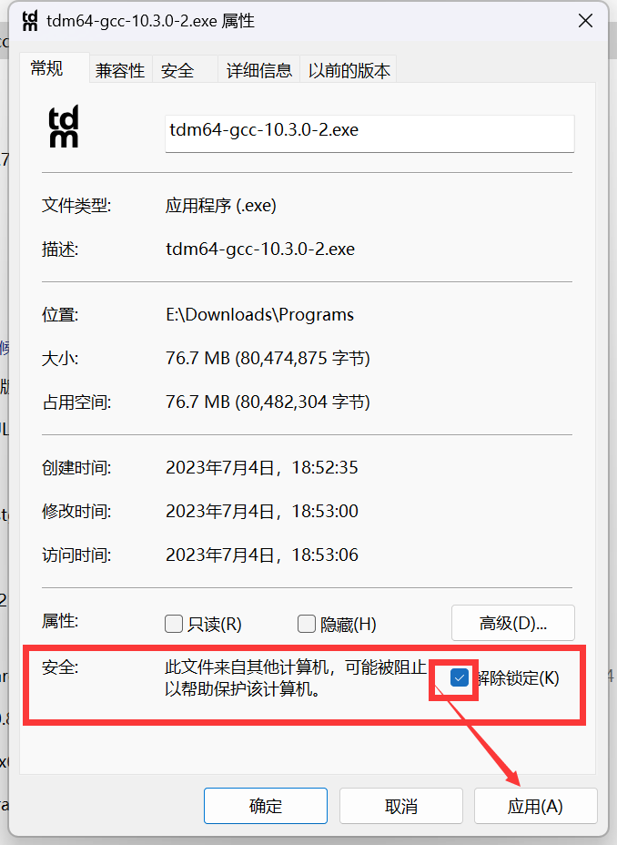
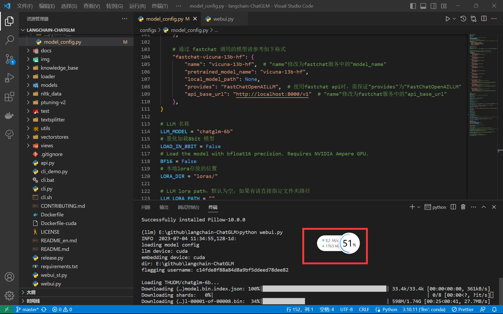

# ChatGLM+LangChain


## ChatGLM-6B

### 基本介绍

清华大学开源的语言模型，基于 GLM 架构

- ChatGLM-6B：https://github.com/THUDM/ChatGLM-6B
- ChatGLM2-6B：https://github.com/THUDM/ChatGLM2-6B

### 具备能力

1、自我认知；2、提纲写作；3、文案写作；4、信息抽取

### 实际应用

通过**通识知识**进行训练，在针对**垂直领域知识**、**私有数据问答**的应用，需要对模型进行**微调**或**提示词工程**，来提升效果。

|            | 概念                                             | 适用场景                                                     |
| :--------: | ------------------------------------------------ | ------------------------------------------------------------ |
|    微调    | 在原有模型的基础上，在少量数据上进一步训练       | 任务和业务领域明确，有足够的标记数据的前提下，通常使用模型微调 |
| 提示词工程 | 涉及自然语言提示或指示，指导语言模型执行特定任务 | 适合高精度和明确输出的任务，比如知识抽取                     |


## LangChain

- GitHub：https://github.com/hwchase17/langchain

- Docs：https://langchain-langchain.vercel.app/docs/get_started

### 基本介绍

一个常用的提示词工程框架。

### 主要功能

1、调用语言模型；

2、将**不同数据源**接入到语言模型交互中；

3、允许语言模型与运行环境交互

### 提供模块

- Modules：支持模型类型和集成
- Prompt：提示词管理、优化和序列化
- ……

### 应用场景

1、文档回答：基于给定文档，只利用文档信息回答问题

2、个人助理

3、查询表格数据

4、与API交互：是大模型允许访问网络最新信息

5、信息提取：从已知文本中提取结构化信息

6、文档总结


## 基于本地知识的问答

### 1 加载本地文档

读取本地文档，加载为文本

### 2 文本拆分

因为语言模型有长度限制，所以需要将文本按照字符、长度、语义进行拆分

- 字符：如按照标点符号拆分

- 长度：如以500字符为一段

- 语义：nlp 语义理解模型

### 3 根据提问匹配文本

根据用户提问，对拆分后的文段进行匹配。

- 字符匹配：精确/模糊搜索的字符匹配
- 语义匹配：文本向量化后，进行向量空间的检索，更常用，可以实现跨语种匹配

### 4 构建 Prompt

将匹配文本、用户提问一同加入到 Prompt 模板中，生成一个提问内容

### 5 LLM 生成回答

将 Prompt 发送给 LLM 获得基于文档内容的回答


## 进一步优化方向

### 1 模型微调

对 LLM 和 Embedding 基于专业领域数据进行微调

### 2 文档加工


### 3 借助不同模型


# Langchain-ChatGLM 部署


## 模型下载

在项目根目录中创建一个 `myModels` 的目录

- THUDM/chatglm2-6b-int4：(https://huggingface.co/THUDM/chatglm2-6b-int4)

> 安装 git-lfs

```sh
git lfs install
```

> 下载 chatglm2-6b-int4 模型

```sh
git clone https://huggingface.co/THUDM/chatglm2-6b-int4
```

- GanymedeNil/text2vec-large-chinese：(https://huggingface.co/GanymedeNil/text2vec-large-chinese)

>下载 text2vec-large-chinese 模型

```sh
git clone https://huggingface.co/GanymedeNil/text2vec-large-chinese
```


## langchain-ChatGLM

### 介绍

- 这个是举例介绍：https://zhuanlan.zhihu.com/p/622717995


### 1 下载项目

- GitHub：https://github.com/imClumsyPanda/langchain-ChatGLM

```sh
git clone https://github.com/imClumsyPanda/langchain-ChatGLM.git
```

- GitHub 发布版：(https://github.com/imClumsyPanda/langchain-ChatGLM/releases/tag/v0.1.16)

### 2 环境配置

#### 2.1 配置基础环境

> 创建虚拟环境

```sh
conda create -n llm01 python=3.10 -y
```

> 激活虚拟环境

```sh
conda activate llm01
```

>提前安装 pycocotools 以防报错

```sh
conda install pycocotools -c conda-forge -y
```

> 依据 `requirements.txt` 安装依赖包

```sh
pip install -r requirements.txt -i https://pypi.tuna.tsinghua.edu.cn/simple/
```

#### 2.2 安装 CUDA 与 cuDNN

安装 cuda11.7：(https://developer.nvidia.com/cuda-11-7-0-download-archive)

- 安装教程：(https://gis-xh.github.io/my-note/deep-learning/Keras-install/#5-cuda)

安装 cudnn8.5：(https://developer.nvidia.com/rdp/cudnn-archive)

- 安装教程：(https://gis-xh.github.io/my-note/deep-learning/Keras-install/#6-cudnn)

> 安装 torch(2.0.1)

之前 requirements 文件安装的是 cpu 版的 torch，这里需要重新安装 gpu 版的 torch

```sh
conda install pytorch torchvision torchaudio pytorch-cuda=11.8 -c pytorch -c nvidia -y
```

#### 2.3 可能会遇到的错误

1、在初次启动时，可能会出现这个错误：

```
Traceback (most recent call last):
  File "E:\github\langchain-ChatGLM\webui.py", line 1, in <module>
    import gradio as gr
  File "E:\Miniconda3\envs\llm\lib\site-packages\gradio\__init__.py", line 3, in <module>
    import gradio.components as components
  File "E:\Miniconda3\envs\llm\lib\site-packages\gradio\components.py", line 30, in <module>
    import PIL.ImageOps
  File "E:\Miniconda3\envs\llm\lib\site-packages\PIL\ImageOps.py", line 24, in <module>
    from . import Image, ImagePalette
  File "E:\Miniconda3\envs\llm\lib\site-packages\PIL\Image.py", line 103, in <module>
    from . import _imaging as core
ImportError: DLL load failed while importing _imaging: 找不到指定的模块。
```

这里通过重新安装 Pillow 可以解决问题。

> 重新安装 Pillow

```sh
pip install --force-reinstall Pillow
```

2、在 CPU 上运行时，会根据硬件自动编译 CPU Kernel ，请确保已安装 GCC 和 OpenMP （Linux一般已安装，对于Windows则需手动安装），以获得最佳并行计算能力。如果本地没有安装 GCC 则会出现这个错误：

```
Compiling kernels : C:\Users\Evolto\.cache\huggingface\modules\transformers_modules\chatglm-6b-int4\quantization_kernels_parallel.c
Compiling gcc -O3 -fPIC -pthread -fopenmp -std=c99 C:\Users\Evolto\.cache\huggingface\modules\transformers_modules\chatglm-6b-int4\quantization_kernels_parallel.c -shared -o C:\Users\Evolto\.cache\huggingface\modules\transformers_modules\chatglm-6b-int4\quantization_kernels_parallel.so
'gcc' 不是内部或外部命令，也不是可运行的程序或批处理文件。
Compile default cpu kernel failed, using default cpu kernel code.
Compiling gcc -O3 -fPIC -std=c99 C:\Users\Evolto\.cache\huggingface\modules\transformers_modules\chatglm-6b-int4\quantization_kernels.c -shared -o C:\Users\Evolto\.cache\huggingface\modules\transformers_modules\chatglm-6b-int4\quantization_kernels.so
'gcc' 不是内部或外部命令，也不是可运行的程序或批处理文件。
```

- 安装地址：(https://jmeubank.github.io/tdm-gcc/)
- 安装教程：[tdm-gcc 的下载、安装教程【超详细】_て°倾寒し的博客-CSDN博客](https://blog.csdn.net/weixin_48820458/article/details/128069360)
- 在安装时，把所有选项都勾选上，有些默认不会安装

需要注意的是，Win11 系统中可能会将外来安装包删除或者锁定。如果在安装时，遇到双击无响应时，需要手动解除锁定才能正常进行安装。



3、当需要使用 CPU 运行项目时，可能会出现如下错误：

```
Warning: self.llm_device is False.
This means that no use GPU  bring to be load CPU mode

Traceback (most recent call last):
  File "E:\github\langchain-ChatGLM-0.1.16\webui.py", line 322, in <module>
    model_status = init_model()
  File "E:\github\langchain-ChatGLM-0.1.16\webui.py", line 103, in init_model
    llm_model_ins = shared.loaderLLM()
  File "E:\github\langchain-ChatGLM-0.1.16\models\shared.py", line 40, in loaderLLM
    loaderCheckPoint.reload_model()
  File "E:\github\langchain-ChatGLM-0.1.16\models\loader\loader.py", line 419, in reload_model
    self.model, self.tokenizer = self._load_model(self.model_name)
  File "E:\github\langchain-ChatGLM-0.1.16\models\loader\loader.py", line 220, in _load_model
    model = LoaderClass.from_pretrained(checkpoint, **params).to(self.llm_device, dtype=float)
  File "E:\Miniconda3\envs\llm01\lib\site-packages\transformers\models\auto\auto_factory.py", line 462, in from_pretrained
    return model_class.from_pretrained(
  File "E:\Miniconda3\envs\llm01\lib\site-packages\transformers\modeling_utils.py", line 2184, in from_pretrained
    raise ImportError(
ImportError: Using `low_cpu_mem_usage=True` or a `device_map` requires Accelerate: `pip install accelerate`
```

> 执行命令安装 accelerate 即可解决

```sh
pip install accelerate
```

4、

解决方案：[RuntimeError: Only Tensors of floating point and complex dtype can require gradients · Issue #483 · imClumsyPanda/langchain-ChatGLM (github.com)](https://github.com/imClumsyPanda/langchain-ChatGLM/issues/483)

#### 2.4 导出环境信息

```sh
conda env export -n llm01 > langchain-ChatGLM.yaml
```


### 3 启动项目

#### 3.1

`models/loader/loader.py` 中添加

```python
# params = {"low_cpu_mem_usage": True, "torch_dtype": torch.float32, "trust_remote_code": True}
params = {"torch_dtype": torch.float16, "trust_remote_code": True}
```


#### 3.2 修改相关参数

打开项目目录中的 `configs/model_config.py` 文件，对相关参数进行修改

1、修改 `embedding_model_dict` 参数，以指定本地embedding模型存储位置

```python
embedding_model_dict = {
    "ernie-tiny": "nghuyong/ernie-3.0-nano-zh",
    "ernie-base": "nghuyong/ernie-3.0-base-zh",
    "text2vec-base": "shibing624/text2vec-base-chinese",
    # "text2vec": "GanymedeNil/text2vec-large-chinese",
    # 使用绝对路径
    "text2vec": "E:/github/LLModels/text2vec-large-chinese",
    "m3e-small": "moka-ai/m3e-small",
    "m3e-base": "moka-ai/m3e-base",
}
```

2、修改 `llm_model_dict` 参数，添加最新版的 chatglm2-6b-int4

```python
"chatglm2-6b-int4": {
    "name": "chatglm2-6b-int4",
    "pretrained_model_name": "THUDM/chatglm2-6b-int4",
    # 使用绝对路径
    "local_model_path": "E:/github/LLModels/chatglm2-6b-int4",
    "provides": "ChatGLM"
},
```

3、然后，将 LLM 名称改为 chatglm2 的最小量化模型。

```python
LLM_MODEL = "chatglm2-6b-int4"
```

在首次启动时，如果本地没有此模型，初次启动后会默认下载到 `$HOME/.cache/huggingface/` 目录下。

4、由于硬件限制，把 LLM 运行设备设置为 CPU

```python
# LLM running device
# LLM_DEVICE = "cuda" if torch.cuda.is_available() else "mps" if torch.backends.mps.is_available() else "cpu"
LLM_DEVICE = "cpu"
```

5、修改传入 LLM 的历史记录长度，将其修改为0，不阅读历史对话，使其对性能需求更低。

```sh
# 传入LLM的历史记录长度
LLM_HISTORY_LEN = 0
```

6、在 `webui.py` 文件的最后把服务器地址改为 `127.0.0.1`

```python
(demo
 .queue(concurrency_count=3)
 .launch(server_name='127.0.0.1',
         server_port=7860,
         show_api=False,
         share=False,
         inbrowser=False))
```

#### 3.3 启动项目

> 体验 Web 交互

```sh
python webui.py
```





## langchain-ChatGLM-webui

### 1 下载项目

- GitHub：(https://github.com/thomas-yanxin/LangChain-ChatGLM-Webui)

```sh
git clone https://github.com/gis-xh/LangChain-ChatGLM-Webui.git
```

### 2 环境配置

#### 2.1 配置基础环境

> 创建虚拟环境

```sh
conda create -n llm-webui python=3.8 -y
```

> 激活虚拟环境

```sh
conda activate llm-webui
```

>提前安装 pycocotools 以防报错

```sh
conda install pycocotools -c conda-forge -y
```

> 依据 `requirements.txt` 安装依赖包

```sh
pip install -r requirements.txt -i https://pypi.tuna.tsinghua.edu.cn/simple/
```

#### 2.2 启动项目

```sh
python3 app.py
```


## 原生 ChatGLM2-6B 部署

```sh
conda create -n chatglm2 python=3.10 -y
```


```sh
conda activate chatglm2
```


```sh
pip install -r requirements.txt
```

