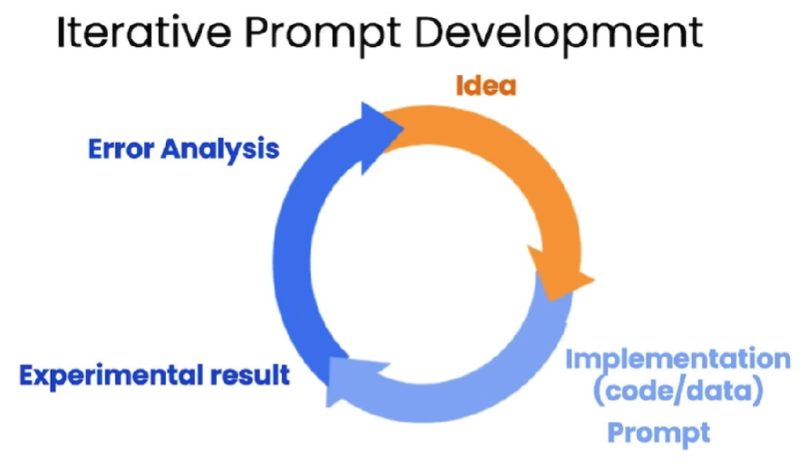

# ChatGPT Prompt Engineering for Developers


## 参考

- 代码参考：https://github.com/datawhalechina/prompt-engineering-for-developers/tree/main/content/Prompt%20Engineering%20for%20Developer
- Deeplearning.AI 原版课程：https://learn.deeplearning.ai/chatgpt-prompt-eng/lesson
- B 站搬运视频：https://www.bilibili.com/video/BV1Bo4y1A7FU/

## 1 基本概念

**指令学习 LLM：**通过对训练好的 Base LLM，调整输入和输出，实现 Instruction Tunned LLM 指令学习 LLM。

**Prompt**：就是用户发送给 LLM 的指令，它可以由不同部分组成。

**提示词注入：**用户被允许在提示中添加的一些输入


## 2 Prompt 两大原则

**Prompt** 提示工程的两大准则：

- 写出清晰明确的提示
- 给 LLM 时间来进行思考

### 2.1 指令清晰明确

**Tactic 1：**使用分割符来明确指出输入的各个不同部分，避免不同部分的内容互相干扰

- 可以是：```，""，<>，:，\<tag>\</tag>等。

**Tactic 2：**可以控制输出内容变得结构化

- 可以是 json、html、markdown 等格式，方便 Python 读取信息进行存储

**Tactic 3：**可以要求模型检查输入内容是否满足条件

**Tactic 4：**提供少量的示例

### 2.2 给模型时间思考

**Tactic 1：**对于一个复杂任务，可以把任务拆分成几个所需的步骤，给模型更多的时间去思考

**Tactic 2：**让模型在下决定之前，找出自己的解法，思考出一份解决方案

### 2.3 模型的局限性

**幻觉：**模型有时可能会说一些听起来似是而非的话

**减少幻觉的策略：**

1、首先让模型从文本中找到任何相关信息引用

2、然后要求模型根据这些相关信息回答问题


## 3 Prompt 优化迭代

通过不断地完善提示，让输出越来越接近需求。



<center>图 1-1 迭代优化 Prompt</center>

**迭代过程**

1、粗略尝试分析结果

2、控制输出的 字符\句子\单词 的长度。

3、指定提示的偏向性，比如更专注于材料，更偏向于技术……

4、让模型分步骤去思考回答问题，并用一批示例完善提示

5、指定输出内容的格式化


## 4 大模型的多种能力

**Summarizing 文本总结：**

- 可以对单一文本或多个文本进行概括性描述
- 可以设置总结的角度侧重，比如侧重于某一具体业务
- 也可以从文本中提炼出关键信息

**Inferring AI 推理：**

- 推断文本中的情绪
- 文本信息提取，提取关键信息
- 从大量文本中推理出文本主题

**Transforming AI 转译：**

- 文本翻译
- 文本格式转换
- 文本语气口吻的转换
- 拼写和语法检查并重写，可以引入 `Redlines` 包，详细显示并对比纠错过程

**Expanding AI 扩写：**

- 利用语言模型参数 `temperature`，改变模型响应的多样性，数值越大越容易分心，但也许更有创造力。


<center>图 1-2 Temperature 参数示例</center>

## 5 构建简单的对话机器人

 利用上下文和 message 响应，实现基于 GPT API 的问答机器人构建。


