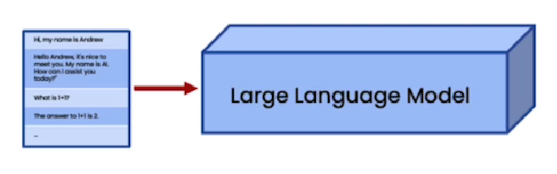
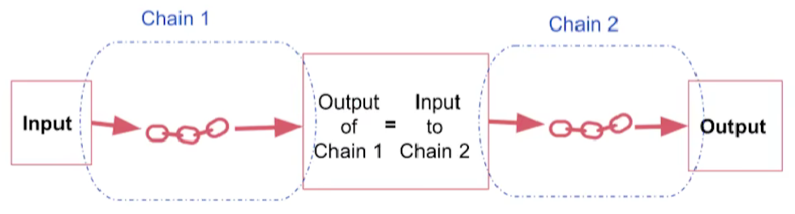
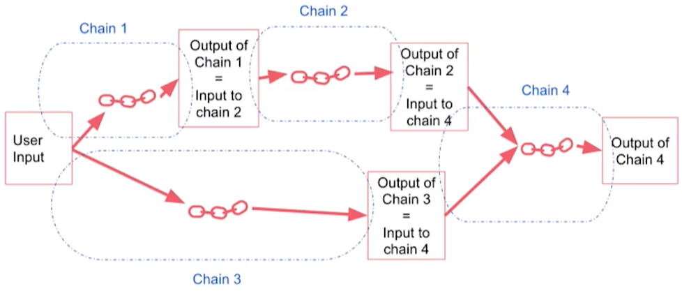
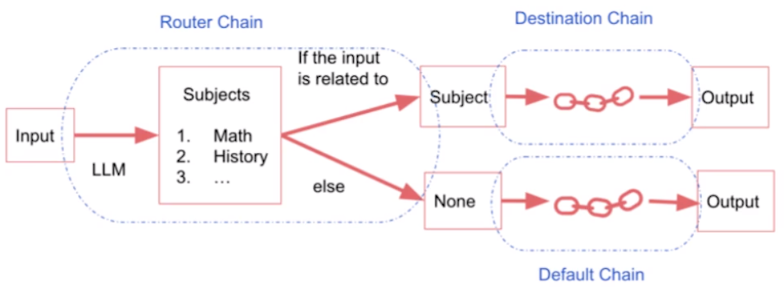
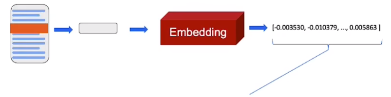
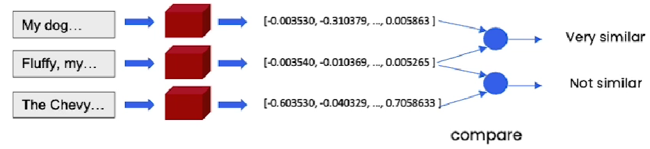
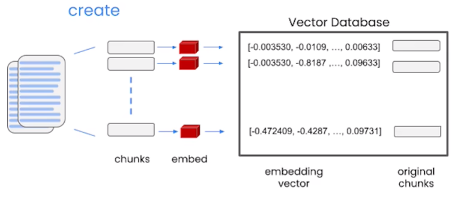
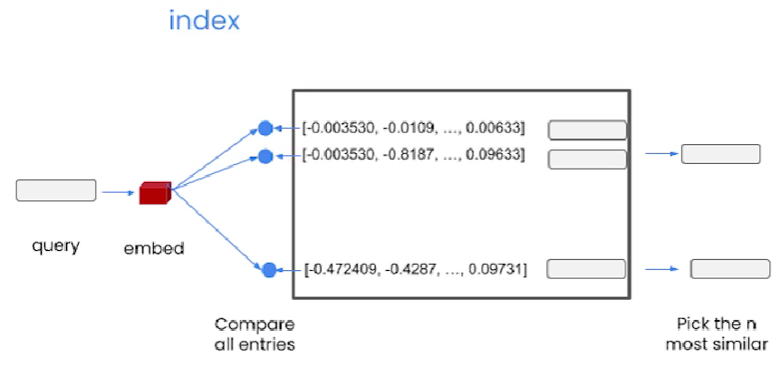
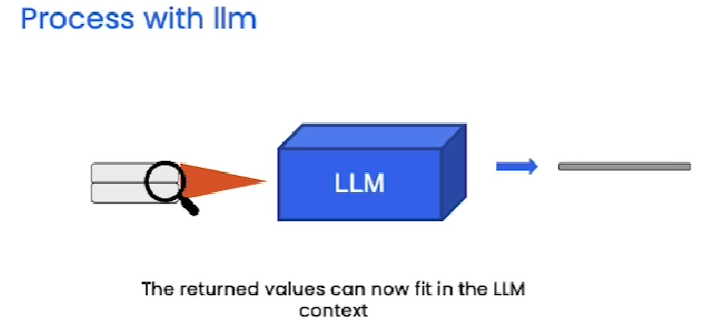
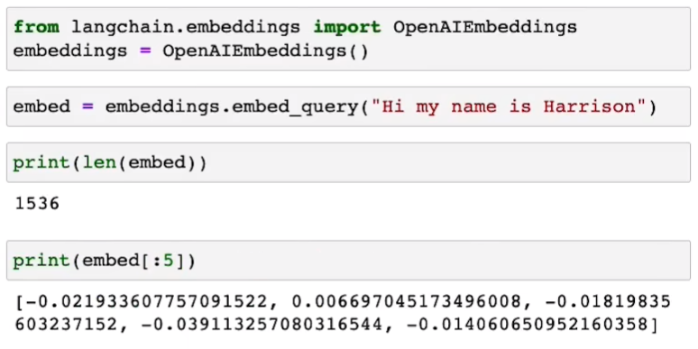

# LangChain for LLM Application Development


## 参考

- 代码参考：https://github.com/datawhalechina/prompt-engineering-for-developers/tree/main/content/Prompt%20Engineering%20for%20Developer
- Deeplearning.AI 原版课程：https://learn.deeplearning.ai/langchain/lesson/
- B 站搬运视频：https://www.bilibili.com/video/BV1Bo4y1A7FU/


## 1 Model, Prompt and Parsers

### 1.1 导入模型

从 `langchain.chat_models` 导入 `OpenAI` 的对话模型 `ChatOpenAI` 

```python
from langchain.chat_models import ChatOpenAI

chat = ChatOpenAI(temperature=0.0)
```

- 将参数 `temperature` 默认为 `0.7`，将其设置为 `0.0`，是为了减少生成答案的随机性。

### 1.2 Prompt 模板

随着构建的应用程序越来越复杂，Prompt 可能会变得非常长，非常详细，所以构建一个快速模板是非常有必要的。

引入 LangChain 聊天提示模板（`ChatPromptTemplate`），通过构造字符串 `template_string` 制作 Prompt 模板，以供重复使用。

> 1、Prompt 模板内容

```py
template_string = """把由三个反引号包含的文本 \
翻译成一种 {style} 风格。 \
文本: ```{text}```
"""
```

> 2、Prompt 生成模板

```python
from langchain.prompts import ChatPromptTemplate
prompt_template = ChatPromptTemplate.from_template(template_string)
```

- `from_template()`：可以获取模板内容中的相关信息，比如输入变量 `{style}` 和 `{text}`

> 3、向模板中填写内容，生成完整的 Prompt

```python
customer_messages  = prompt_template.format_messages(
    style=customer_style,
    text=customer_email
)
```

> 4、调用并输出 Chat 模型的结果

```python
customer_response = chat(customer_messages)

print(customer_response.content)
```

此外，LangChain 还提供了 Prompt 模版用于一些常用场景。比如：

- 自动摘要、问答、连接到SQL数据库、连接到不同的API

通过使用 LangChain 内置的提示模版，可以快速建立自己的大模型应用，而不需要花时间去设计和构造提示。

最后，我们在建立大模型应用时，通常希望模型的输出为给定的格式，比如在输出使用特定的关键词来让输出结构化。

通过使用 LangChain 库函数，输出采用下列特定的单词作为链式思考推理（Chain-of-Thought Reasoning, ReAct）的关键词，让输出结构化。

- "Thought"（思考）
- "Action"（行动）
- "Observation"（观察）

### 1.3 output_parsers 输出解析器

虽然我们通过 Prompt 提示大模型生成出格式化的结果，但是其结果仍然还是字符串类型的数据。通过 LangChain 可以将结果解析成目标格式。

> 1、构造 langchain 提示模版

- 先设置好文本

```python
customer_review = """\
这款吹叶机非常神奇。 它有四个设置：\
吹蜡烛、微风、风城、龙卷风。 \
两天后就到了，正好赶上我妻子的\
周年纪念礼物。 \
我想我的妻子会喜欢它到说不出话来。 \
到目前为止，我是唯一一个使用它的人，而且我一直\
每隔一天早上用它来清理草坪上的叶子。 \
它比其他吹叶机稍微贵一点，\
但我认为它的额外功能是值得的。
"""
```

- 然后设置 Prompt 模板

```python
review_template = """\
对于以下文本，请从中提取以下信息：

gift：该商品是作为礼物送给别人的吗？
如果是，则回答 True；如果否或未知，则回答 False。

delivery_days：产品到达需要多少天？ 如果没有找到该信息，则输出 -1。

price_value：提取有关价值或价格的任何句子，并将它们输出为逗号分隔的 Python 列表。

文本: {text}

{format_instructions}
"""

prompt = ChatPromptTemplate.from_template(review_template)
```

> 2、导入响应模式和结构化输出解析器

```python
from langchain.output_parsers.structured import (
    StructuredOutputParser, ResponseSchema)
```

- `StructuredOutputParser()` 结构化输出解析器，可以将 LLM 调用的输出解析为结构化输出。

  - 根据关键字参数解析和验证输入数据，创建新模型。


  - 如果输入数据无法解析以形成有效的模型，则引发ValidationError。


- `ResponseSchema()` 是控制输出解析器的响应模式，它有三个参数：

  - `name`：*[Required]*，关键字参数

  - `type`：响应的数据类型，比如 `boolean、number、string` 等

  - `description`：*[Required]*，是关键词对应的详细内容


> 3、构造输出解析器

```python
gift_schema = ResponseSchema(name="gift",
                             type="boolean",
                             description="这件物品是作为礼物送给别人的吗？如果是，则回答 True，如果否或未知，则回答 False。")

delivery_days_schema = ResponseSchema(name="delivery_days",
                                      type="number",
                                      description="产品需要多少天才能到达？如果没有找到该信息，则输出 -1。")

price_value_schema = ResponseSchema(name="price_value",
                                    type="string",
                                    description="提取有关价值或价格的任何句子，并将它们输出为逗号分隔的 Python 列表")
# 以列表类型拼接
response_schemas = [gift_schema, delivery_days_schema, price_value_schema]
output_parser = StructuredOutputParser.from_response_schemas(response_schemas)
# `get_format_instructions()` 获取输出解析器的格式指令
format_instructions = output_parser.get_format_instructions()
print(format_instructions)
```

- `from_response_schemas()`：读取配置好的响应模式
- `get_format_instructions()`：输出一个带有如下格式的数据，所以后面才会统一输出成 `json` 格式

````
The output should be a markdown code snippet formatted in the following schema, including the leading and trailing "```json" and "```":

```json
{
	"gift": boolean  // 这件物品是作为礼物送给别人的吗？如果是，则回答 True，如果否或未知，则回答 False。
	"delivery_days": number  // 产品需要多少天才能到达？如果没有找到该信息，则输出 -1。
	"price_value": string  // 提取有关价值或价格的任何句子，并将它们输出为逗号分隔的 Python 列表
}
```
````

> 4、使用模版得到 Prompt Messages

```python
messages = prompt.format_messages(
    text=customer_review,
    format_instructions=format_instructions)
print(messages[0].content)
```

>5、调用 chat 模型提取信息

```python
response = chat(messages).content
print(response)
```

````
```json
{
	"gift": true,
	"delivery_days": 2,
	"price_value": "稍微贵一点"
}
```
````

> 6、使用输出解析器解析输出

```python
output_dict = output_parser.parse(response)
print("输出类型:", type(output_dict), "\n输出内容:", output_dict)
```

- `parse()`：将单个字符串的模型输出解析为某种结构（目前只实现了字典类型）。

```
输出类型: <class 'dict'> 
输出内容: {'gift': True, 'delivery_days': 2, 'price_value': '稍微贵一点'}
```


## 2 记忆 Memory

### 2.1 聊天机器人原理

在与大语言模型进行聊天对话时，模型本身是不具备状态和记忆的。每次交互，每次调用 API 都是独立的。

聊天机器人借助缓存完整上下文并提交给语言模型的形式，给对话添加了 “语境” 从而实现了记忆能力。每次对话，都会将上文中所有内容形成与对话一同输入，所以随着对话变得越来越长，所需的内存量也变得非常长。



<center>图 3-1 大语言模型的记忆力</center>

### 2.2 LangChain 实现记忆力

Memory：使用内存作为对话缓冲区的存储，每一次的对话，都代表着重复提交之前所有的对话内容。

LangChain 提供了几种内存类型来存储和积累对话。

> 1、初始化模型

```python
from langchain.chains import ConversationChain
from langchain.chat_models import ChatOpenAI
from langchain.memory import ConversationBufferMemory

llm = ChatOpenAI(temperature=0.0)
```

> 2、初始化记忆

缓存记忆 `ConversationBufferMemory()` 

```python
memory = ConversationBufferMemory()
```

> 3、添加记忆并打印

```python
memory.save_context({"input": "Hi, my name is evolto"}, {"output": "Hi evolto, have a good day!"})

print(memory.buffer)
```

> 4、以字典类型查看内存变量

```python
memory.load_memory_variables({})
```

> 5、新建 ConversationChain Class 实例

```python
# verbose参数设置为True时，程序会输出更详细的信息，以提供更多的调试或运行时信息。
# 相反，当将verbose参数设置为False时，程序会以更简洁的方式运行，只输出关键的信息。
conversation = ConversationChain(
    llm=llm,
    memory=memory,
    verbose=True)
```

> 6、进行一轮对话

```python
conversation.predict(input="What's my name?")
```


### 2.3 限制窗口的缓存记忆

`ConversationBufferWindowMemory()`：可以设置仅仅追踪最近几次的对话交流，防止随着对话的进行内存占用无限增长。

> 初始化记忆

```python
from langchain.memory import ConversationBufferWindowMemory

memory = ConversationBufferWindowMemory(k=1)
```

- `k=1`：只记忆上一次对话的内容

### 2.4 限制 Token 的缓存记忆

`ConversationBufferTokenMemory()`：考虑到不少大模型都是通过 Token 来计费的，可以设置 Token 上限，防止随着对话的进行 Token 无限增长。

> 初始化记忆

```python
from langchain.memory import ConversationBufferTokenMemory

memory = ConversationBufferTokenMemory(
    llm=llm,
    max_token_limit=50)
```

- 指定模型是因为不同的语言模型使用不同的 Token 计数方式
- `max_token_limit=50`：保留最近交流的 50 个 Token 数量

### 2.5 总结摘要缓存记忆

`ConversationSummaryBufferMemory()`：不再做具体的记忆限制，而是将目前为止的对话生成一个摘要，并将其作为记忆。

> 初始化记忆

```python
from langchain.memory import ConversationSummaryBufferMemory

memory = ConversationSummaryBufferMemory(
    llm=llm,
    max_token_limit=200 
```

不只是运用于聊天机器人，当我们在获取大量新的文本片段或新的信息时，可以利用摘要缓存的方法减少记忆所占用的内存和 Token 长度。

### 2.6 小结

1、向量数据库缓存记忆

尽管上述的记忆类型实现了上下文的记忆缓存，但是仍然受到内存占用以及 Token 数量的限制。将文本存储在向量数据库中，并在向量数据库中检索最相关的文本块。

2、实体缓存记忆

用于记忆上下文中关于特定人物、特定实体的详细信息情况。


## 3 Chains 链条

### 3.1 LLMChain

Chain 通常与 LLM、Prompt 一起结合使用，将一系列操作构建成块放在一起，对文本或其他数据执行后续操作。

LLMChain 就是将 LLM 与 Prompt 组合起来，是最基本的 Chains。它可以将 Prompt 进行格式化，从而提高模型问答精度

> 1、导出 LLMChain 与 Prompt 模板

```python
from langchain.chat_models import ChatOpenAI
from langchain.prompts import ChatPromptTemplate
from langchain.chains import LLMChain
```

> 2、生成 Prompt 模板

```python
prompt = ChatPromptTemplate.from_template(
    "描述一家生产 {product} 的公司最好的名字是什么?"
)
```

> 3、调用 LLMChain

```python
chain = LLMChain(llm=llm, prompt=prompt)
```

- `LLMChain()`：将 LLM 与已有的 Prompt 模板进行组合

> 4、运行 LLMChain

```python
product = "Queen Size Sheet Set"
chain.run(product)
```

### 3.2 Sequential Chains 顺序链

顺序链是将多个 Chains 按顺序运行，上一个 Chain 的输出作为下一个 Chain 的输入。有两种类型的顺序链：

- `SimpleSequentialChain()`：单个输入/输出



<center>图 3-2 SimpleSequentialChain: 单个输出输出的顺序链</center>

- `SequentialChain()`：多个输入/输出



<center>图 3-3 SequentialChain: 多个输出输出的顺序链</center>

### 3.3 Router Chain 路由链

设置多个子链，每个子链专门处理特定类型的输入，将由路由链决定将其传递给哪一个子链。

并且预设一个 `Default Chain` 在不确定输入数据时，调用此链，对语言模型进行一般性调用。



<center>图 3-4 Router Chain: 路由链</center>

- `MutiPromptChain()`：多提示链，用于在多个不同 Prompt 模板间进行路由

- `LLMRouterChain()`：使用语言模型本身来路由不同的子链间

- `RouterOutputParser()`：将 LLM 输出解析为可以在下游使用的字典类型数据，以确定使用哪个链以及该链的输入数据时什么


## 4 基于文档的 QA 问答

### 4.1 Embedding 模型



<center>图 3-5 Embeddings 工作原理-1</center>

- Embeddings 是将文本片段转换为数值表示的方法，用数值表示捕捉到应用的文本片段的语义含义。
- 相似内容的文本片段在数值空间中会具有相似的向量
- 通过计算 **向量间的点积**（`np.dot(a, b)` 即为计算向量 a 与向量 b 间的点积）的值比较这些向量间的相似程度，找到相似度高的文本片段

```
1) My dog Rover likes to chase squirrels.
2) Fluffy, my cat, refuses to eat from a can.
3) The Chevy Bolt accelerates to 60 mph in 6.7 seconds.
```



<center>图 3-6 Embeddings 工作原理-2</center>

### 4.2 向量存储流程

1、**创建存储：**将其中的文本块填充为来自输入文档的块

- 首先，将输入的大文本分解成较小的子块
- 然后，将每一个块创建一个 Embedding
- 最后，将所有结果存储在向量数据库中



<center>图 3-7 文档内容创建向量数据库存储</center>

2、**向量匹配：**使用索引查找与输入查询 query 最相关的文本片段

- 首先，对输入的查询创建 Embedding
- 然后，将其与向量数据库中所有向量进行比较，并选择最相似的前 n 个



<center>图 3-8 查询内容与向量数据库进行匹配</center>

3、**传递给LLM：**将返回的 n 个最相似的块与输入的查询一同作为 Prompt 传递给语言模型，得到答案。



<center>图 3-9 将相似向量输入给 LLM</center>

4、Embedding 示例代码



<center>图 3-10 文本转向量数据示例</center>


LLM 的输出内容无法进行字符串匹配，精确匹配或者一些正则匹配


## 5 模型评估

比较字符串的困难是评估语言模型的难点所在。


## 6 Agents 代理

