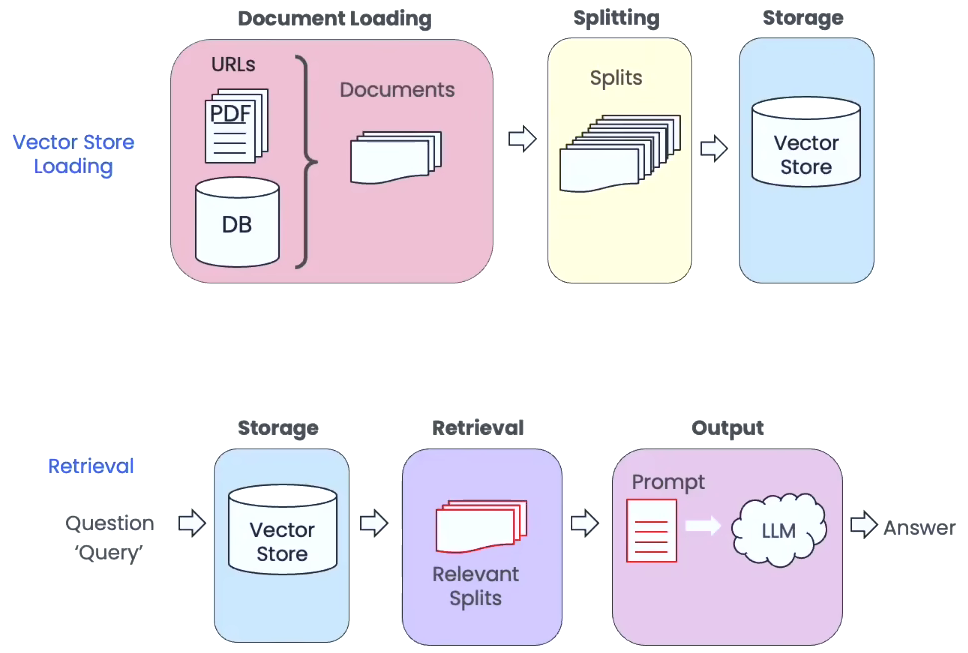
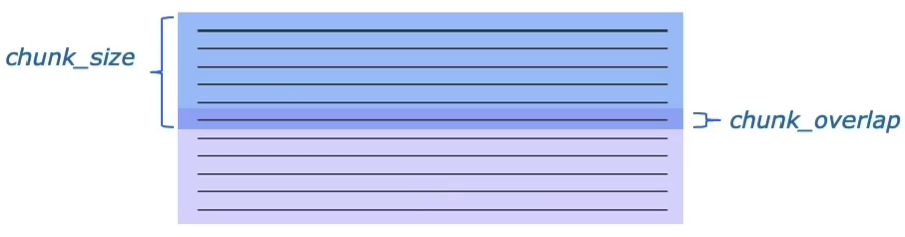
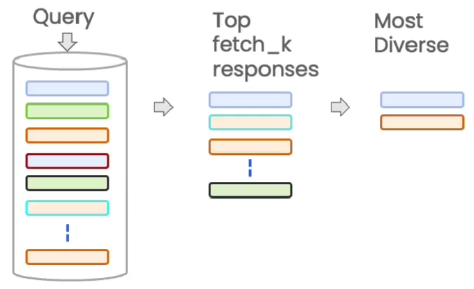
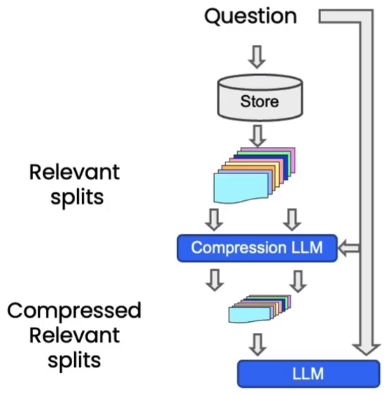
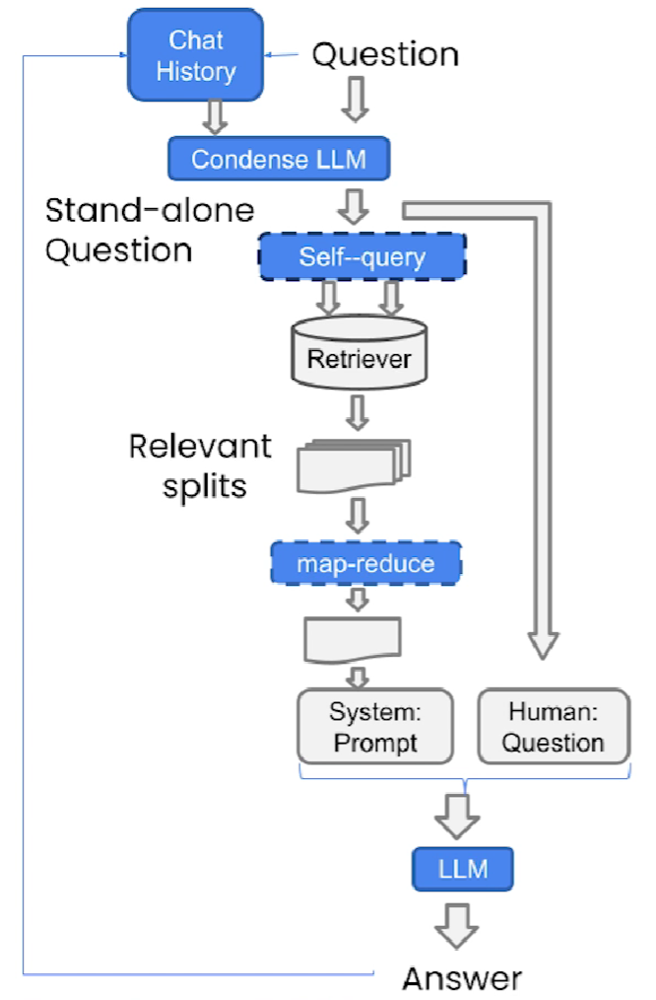

# LangChain Chat With Your Data

## 参考

- 代码参考：https://github.com/datawhalechina/prompt-engineering-for-developers/tree/main/content/Prompt%20Engineering%20for%20Developer
- Deeplearning.AI 原版课程：https://learn.deeplearning.ai/langchain-chat-with-your-data/lesson/
- B 站搬运视频：【吴恩达与LangChain创始人最新课程《LangChain：与你的数据对话》whisper转文本+GPT翻译中文字幕】 https://www.bilibili.com/video/BV148411D7d2

## 1 流程介绍



1、Document Loading：使用文档加载器加载各个来源的数据

2、Splitting：将文档内容拆分为语义上有意义的子块

3、Storage：将存储与向量数据库中


## 2 文档加载

将各种来源的数据加载到一个标准的文档对象中，对象是由 `page_content` 内容和 `metadata`  元数据组成。结构化和非结构化数据都可以加载。

### 2.1 加载 PDF 文件

以文本和表格为主

### 2.2 加载 Youtube 视频

视频音频作为非结构化数据，视频转文本前需要先在下载安装 FFmpeg

- [Download FFmpeg](http://www.ffmpeg.org/download.html#build-windows)
- [Releases · BtbN/FFmpeg-Builds (github.com)](https://github.com/BtbN/FFmpeg-Builds/releases)

> 安装相关包

```sh
pip -q install yt_dlp pydub ffmpeg ffprobe
```

1、在 Windows 系统中下载时，要选择 `ffmpeg-master-latest-win64-gpl.zip` 完整版下载。

2、将 `ffmpeg/bin` 目录写入环境变量中  

3、`YoutubeAudioLoader`：Youtube 音频加载器，根据指定 URL 地址找到对应视频，从视频中保存音频文件到本地

4、`OpenAIWhisperParser`：使用 OpenAI 的 Whisper 模型（语音转文本模型）,将视频中的音频转换为可处理的文本格式。

### 2.3 加载网页数据

1、`WebBaseLoader`：基于 Web 的加载器，可以读取 url 链接


### 2.4 加载 Notion 数据库数据


## 3 文档分割

在进行检索增强生成时，需要检索与讨论的内容最相关的内容片段，只选择与讨论的主题最相关的段落或句子，而不是加载整个文档。

在分割时，要尽可能地保证分割成语义相关的块。文本分割的基础就是保证块与块之间具有一定的重叠。在 LangChain 中文档分割具有两个重要参数。

- `chunk_size`：块的大小
- `chunk_overlap`：块重叠部分的大小



<center>图 4-1 文本分割示意图</center>

### 3.1 基于字符的文本分割


### 3.2 基于 Token 的文本分割


### 3.3 小结

通过对文档的分割，可以获得具有适当元数据的语义相关的子块，下一步就是将数据块移动到向量存储中。


## 4 向量存储与语义搜索

### 4.1 存储流程

流程同 3.4.2 节，在进行 embedding 分割后，可以计算向量点积求得向量间的相似程度。

### 4.2 通过语义相似性进行搜索

> 1、加载本地文档

- 首先，导入文档加载的包；
- 然后，批量导入指定路径下所有的 txt 文件，并显示进度条

```python
from langchain.document_loaders import DirectoryLoader, TextLoader

path = "./data/youtube"
loader = DirectoryLoader(path, glob="**/*.txt", loader_cls=TextLoader, show_progress=True)
pages = loader.load()
```

> 2、分割文档

- 首先，加载文本分割的包；
- 然后，预设块和块重叠的大小；
- 接着，初始化文本分割器，并设置多种分隔符；
- 最后，调用函数分割文档，可以打印出分割前的块数查看分割情况。

```python
from langchain.text_splitter import RecursiveCharacterTextSplitter

chunk_size = 450
chunk_overlap = 50

r_splitter = RecursiveCharacterTextSplitter(
    chunk_size=chunk_size,
    chunk_overlap=chunk_overlap,
    separators=["\n\n", "\n", "(?<=\. )", " ", ""]
)

splits_docs = r_splitter.split_documents(pages)
print("分割前:", len(pages), "\n分割后:", len(splits_docs))
```

> 3、加载 Embedding 模型

- 加载 OpenAI 的 Embedding 模型作为向量存储的 Embedding 模型。

```python
from langchain.embeddings.openai import OpenAIEmbeddings
embedding = OpenAIEmbeddings()
```

> 4、加载向量数据库

LangChain 集成了 30 多种不同的向量存储，选用 Chroma 作为向量数据库，是因为其易用轻巧且存储在内存中。

- 首先，在初次使用时，要先在虚拟环境中安装好向量数据库的相关包。

```python
pip install chromadb clickhouse-connect tiktoken
```

- 然后，加载向量数据库 Chroma 的包，并设置数据库文件存放目录（确保此目录为空）
- 最后，通过向函数传入分割后的文本、 Embedding 模型、数据库存储路径等参数实现向量存储。

```python
from langchain.vectorstores import Chroma

persist_directory = 'data/chroma/SciPy2023_Presentation_Geemap/'
vectordb = Chroma.from_documents(
    documents=splits_docs,
    embedding=embedding,
    persist_directory=persist_directory
)

print("向量个数: ", vectordb._collection.count())
```

> 5、发起提问

- 首先，提取相关问题，发起查询 query
- 然后，使用 `similarity_search()` 相似性搜索方法，传入问题和并指定返回的文本长度的块数

```python
question = "I want to know how Geemap is used in research?"

answer = vectordb.similarity_search(question, k=3)

print(answer[0].page_content)
```

### 4.3 小结

尽管相似性搜索在回答相关性较高的问题上可以解决不少问题，但是在一些边缘问题，会存在一些错误，这有一部分是由于块与块之间的重复片段导致的。


## 5 其他语义检索技术

### 5.1 MMR 最大边际相关性

如果只是选择在向量空间中最相似向量对应的文档，实际上会错过一些多样化信息。MMR 会选择一组多样化的文档，能够很好地**解决多样性问题**。

- 首先，接受一个 query 查询
- 然后，通过参数 `fetch_k` 控制响应的个数
- 最后，生成多样化的文本片段返回给用户。



<center>图 4-2 MMR 处理流程图</center>

### 5.2 SelfQuery 自查询

当问题不仅涉及到语义上查找的内容，还包括一些相关筛选后的元数据时，通过对语言模型进行更多地调用，将合适的最终答案集中在最重要的内容上。

- 首先，将原始问题分割为两个独立部分 Filter 筛选器和 Search term 搜索词

- 然后，根据元数据对向量数据进行筛选，在对搜索词进行相关语义查询


<center>图 4-3 查询相关语义与元数据的示例图</center>

### 5.3 Compression 上下文压缩

通过压缩，可以将所有检索到的相关文档通过语言模型提取出最相关的片段，缩减对相关信息的响应，增加可以放在上下文中的结果的数量。

然后只将最相关的片段传递到最后的语言模型中。



<center>图 4-4 压缩流程图</center>


## 6 QA 基于语义检索内容的问答

### 6.1 基于 Prompt 模板的检索式问答链

针对单个文档，或文档较少时，可以结合 Prompt 模板调用语言模型进行检索问答。

> 1、加载语言模型

```python
from langchain.chat_models import ChatOpenAI

llm = ChatOpenAI(model_name="gpt-3.5-turbo", temperature=0)
```

> 2、生成 Prompt 模板

- 首先，导入 `PromptTemplate` 包
- 然后，创建一个带有分隔符较为精确的 Prompt
- 最后，利用 `from_template()` 生成 Prompt 模板

```python
from langchain.prompts import PromptTemplate

template = """使用以下上下文片段来回答最后的问题。
如果你不知道答案，只需说不知道，不要试图编造答案。
答案最多使用三个句子。尽量简明扼要地回答。
在回答的最后一定要说"感谢您的提问！"
{context}
问题：{question}
有用的回答："""
QA_CHAIN_PROMPT = PromptTemplate(
    input_variables=["context", "question"],
    template=template
)
```

> 3、构造检索式问答，导入 `RetrievalQA` 包，声明一个检索式问答链

- 调用的语言模型
- 作为检索器的向量数据库，默认使用 stuff 模式
- 开启返回源文档信息的功能
- 并且传入预设好的 Prompt 模板

```python
from langchain.chains import RetrievalQA

qa_chain = RetrievalQA.from_chain_type(
    llm,
    retriever=vectordb.as_retriever(),
    return_source_documents=True,
    chain_type_kwargs={"prompt": QA_CHAIN_PROMPT}
)
```

> 4、将问题作为查询进行调用

```python
question = "I want to know how Geemap is used in research?"

result = qa_chain({"query": question})

result["result"]
```

### 6.2 基于 MapReduce 的检索式问答链

当文档太多时，语言模型无法将它们全都适配到上下文窗口中；MapReduce 文档链的原理是：

- 先将每个独立的文档单独发送到语言模型以获取原始答案
- 然后这些答案通过最终对语言模型的一次调用组合成最终的答案。

> 1、重新定义 QA 检索

- Chain 链类型设为 `MapReduceDocumentsChain()` 文档链

```python
qa_chain_mr = RetrievalQA.from_chain_type(
    llm,
    retriever=vectordb.as_retriever(),
    chain_type="map_reduce"
)
```

> 2、再次提问

```python
question = "I want to know how Geemap is used in research?"

result = qa_chain_mr({"query": question})
result["result"]
```

### 6.3 基于 Refine 的检索式问答链

实测效果最好

> 重新定义 QA 检索

- Chain 链类型设为 `RefineDocumentsChain()` 文档链

```python
qa_chain_r = RetrievalQA.from_chain_type(
    llm,
    retriever=vectordb.as_retriever(),
    chain_type="refine"
)

result = qa_chain_r({"query": question})
result["result"]
```


## 7 上下文对话

记录之前与语言模型交流的任何对话和信息，作为聊天历史记录。使得 LLM 在回答问题时，能够综合考虑当前问题和聊天历史记录中的内容。




<center>图 4-5 上下文 QA 对话流程图</center>

为了实现上下文对话，保存一个聊天消息的列表作为历史记录是缓存区，并在每次对话时将这些消息与问题一起传递给 LLM

- 首先，要添加 `ConversationBufferMemory` 对话缓冲存储
- 然后，指定 `chat_history` 作为聊天消息的缓存方式
- 最后，设置返回的聊天历史记录是列表形式，而不是字符串

```python
from langchain.memory import ConversationBufferMemory
memory = ConversationBufferMemory(
    memory_key="chat_history",
    return_messages=True
)
```

