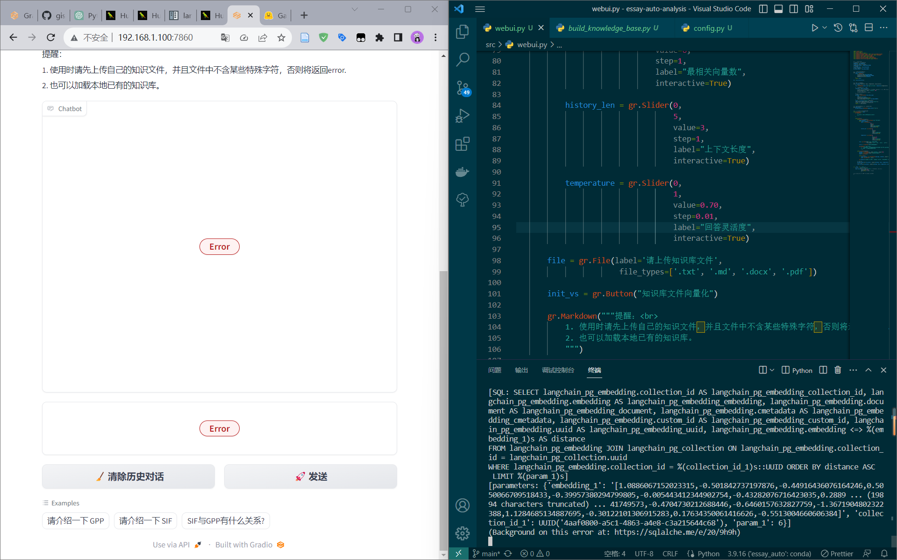

# Building Generative AI Applications with Gradio

- Deeplearning.AI 原版课程：https://learn.deeplearning.ai/huggingface-gradio/lesson/
- B 站搬运视频：吴恩达最新课程《使用Gradio构建生成式人工智能应用程序/Building Generative AI Applications with Gradio》https://www.bilibili.com/video/BV1rk4y137Ty

不同 Embedding 模型分割的向量长度是不相同的，所以需要保证构建知识库进行分割和问答时使用的是一个模型，否则会出现不匹配的情况。

