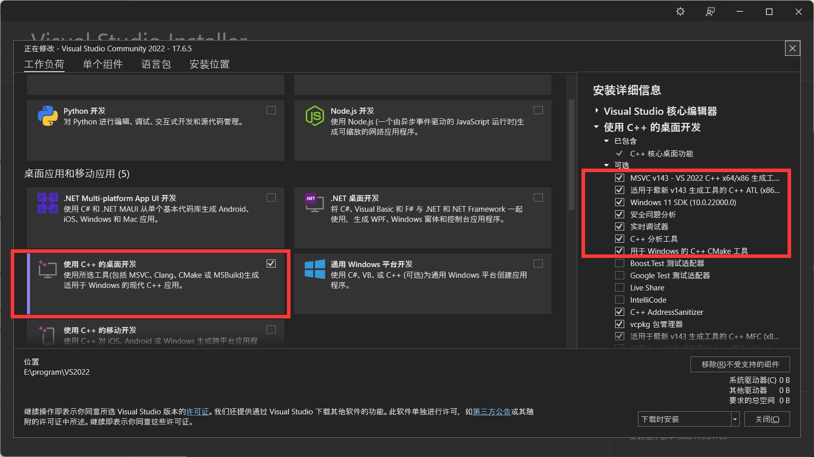
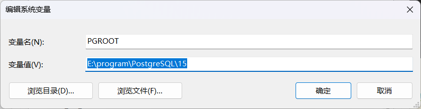
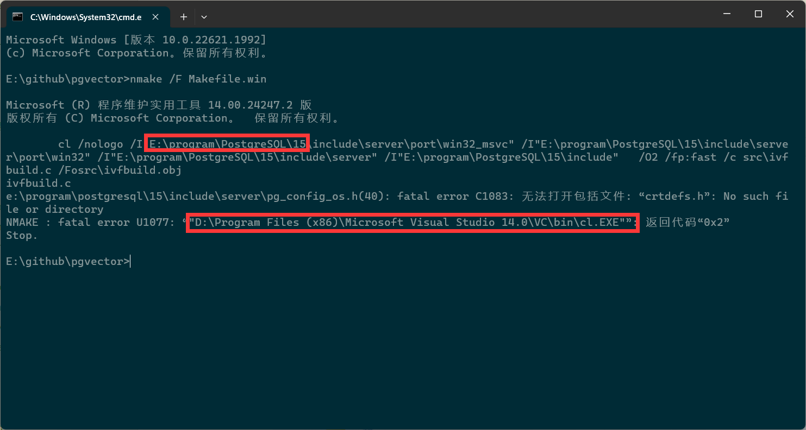
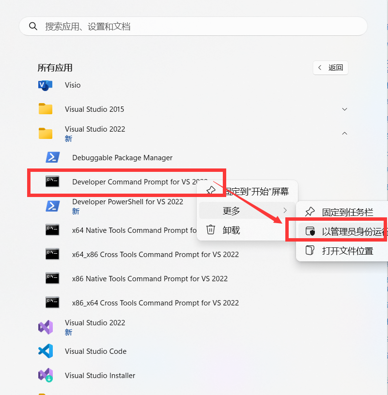
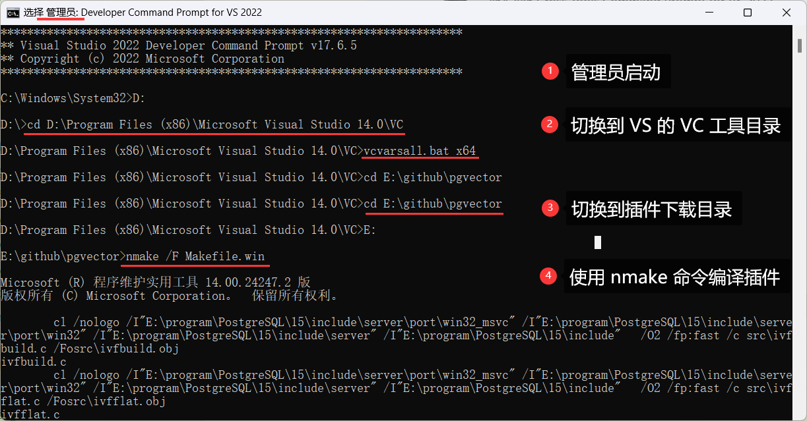
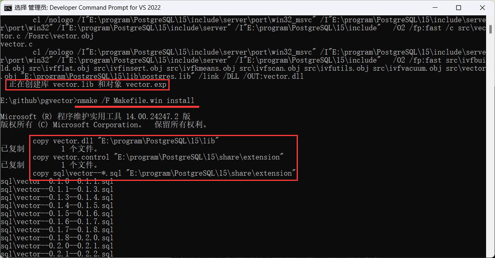
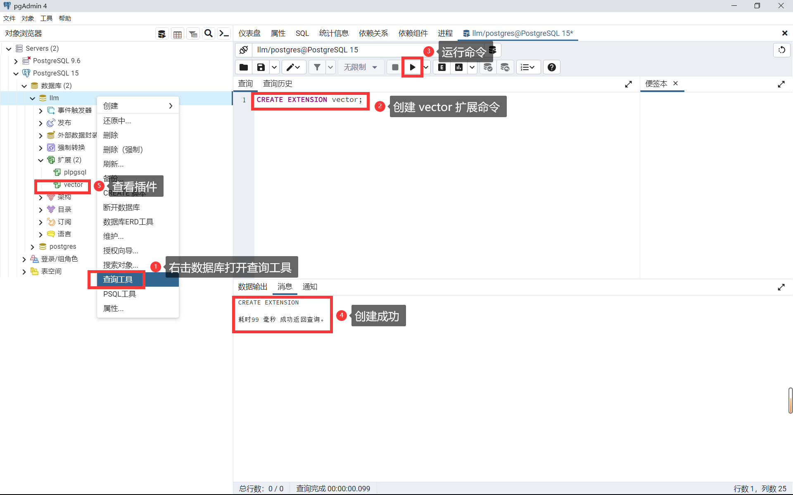

# 向量数据库


## 1 pgvector 安装配置

在 Windows 系统中，安装 pgvector 很容易出现问题，所以把本次在 Windows 上成功安装的过程记录下来。

- pgvector 的 GitHub 仓库：https://github.com/pgvector/pgvector

### 参考

- [在 Windows 上构建错误 · Issue #70 · pgvector/pgvector · GitHub](https://github.com/pgvector/pgvector/issues/70)
- [不能在 Windows 上使用 nmake 构建 · Issue #90 · pgvector/pgvector · GitHub](https://github.com/pgvector/pgvector/issues/90)
- [lnk2019 - 解决 LNK4272 错误 -  Stack Overflow](https://stackoverflow.com/questions/76269972/resolving-lnk4272-errors/76333347#76333347)

### 1.1 安装 VS2022 C/C++ 编译环境

1、首先，安装 VS2022 社区版，安装 **"使用 C++ 的桌面开发"** 模块并在右侧选择所有 C++ 相关的包。




2、安装好 VS 还不够，还需要讲必要的工具加入环境变量，这样在编译一些使用 C/C++ 编写的包才正常编译。（有不少 Python 是使用 C/C++ 编写的，在安装时需要编译，这样做会省去后续很多麻烦）

- 找到存放着 `nmake.exe` 和 `cl.exe` 程序的目录，添加到到环境变量 `Path` 中，方便后续使用 `nmake` 编译命令
- 根据实际情况找到安装的实际位置，将其添加到 `Path` 中，本机安装的目录如下：

```
D:\Program Files (x86)\Microsoft Visual Studio 14.0\VC\bin\
```

### 1.2 安装 PostgreSQL

1、先到官网下载安装 [PostgreSQL](https://www.enterprisedb.com/downloads/postgres-postgresql-downloads)，最好下载高版本的（11 及以上的）

2、然后，新建系统变量 `PGROOT`，将 PostgreSQL 的安装地址添加为变量值




### 1.3 下载并尝试编译 pgvector 插件

1、找到合适的位置，使用 git 命令克隆插件包

```sh
git clone --branch v0.4.4 https://github.com/pgvector/pgvector.git
```

2、在插件所在目录，启动 cmd 命令，使用 `nmake` 命令编译插件

- 一般情况下，直接在插件目录使用 cmd 命令编译会失败。

```sh
nmake /F Makefile.win
```




### 1.4 使用 VS 编译并安装插件

因为直接使用 `nmake` 编译会出现上述错误。所以，我们需要使用 VS2022（其他版本也可以）的 `Developer Command Prompt` 开发者命令行对插件进行编译。

1、首先，以管理员身份运行 `Developer Command Prompt` 




2、切换到 `vcvarsall.bat` 所在的目录

```sh
cd D:\Program Files (x86)\Microsoft Visual Studio 14.0\VC
```

3、以 64 位启动 `vcvarsall.bat` 

```
vcvarsall.bat x64
```

4、切换到插件下载目录（不同盘符要先切盘、在切目录）

```sh
cd E:\github\pgvector
```

5、再次使用 `nmake` 进行编译

```sh
nmake /F Makefile.win
```




6、编译完成后，不要关闭命令行窗口，还需要将编译好的结果安装到 PostgreSQL 中

```sh
nmake /F Makefile.win install
```




### 1.5 在数据库中创建插件

1、首先，创建好一个数据库

2、然后，右击创建好的数据库，点击 **查询工具**

3、在查询窗口中输入命令，创建查询扩展，运行命令即可将 pgvector 插件成功导入到数据库中

```sql
CREATE EXTENSION vector;
```




